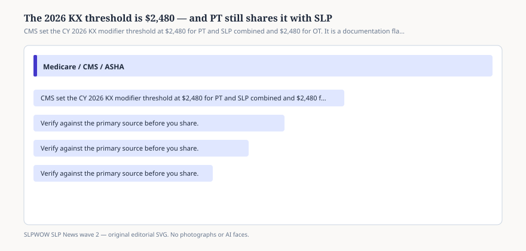

# The 2026 KX threshold is $2,480 — and PT still shares it with SLP

*Educational news brief for SLPWOW. Not legal advice, not billing advice, and not a substitute for reading the primary source or for evaluation by a licensed clinician.*

CMS’s Therapy Services page, updated for calendar year 2026, prints the number without romance. The KX modifier threshold is **$2,480** for physical therapy and speech-language pathology services **combined**, and **$2,480** for occupational therapy. MLN Matters MM14315 says the same pair. Claims that cross the line without the KX modifier are denied.

The Bipartisan Budget Act of 2018 is why this is a threshold and not the old hard cap. Section 50202 kept the old dollar amounts as a tripwire: above this, the modifier is the clinician’s attestation that the services are medically necessary and that the record can show it. The dollar figure indexes with the Medicare Economic Index. It is not a moral limit on how much speech a person may need.

## Combined means combined

<figure class="slpwow-figure slpwow-figure--infographic" itemscope itemtype="https://schema.org/ImageObject">
  
  <figcaption itemprop="caption">
    <strong>Figure 1.</strong> CMS set the CY 2026 KX modifier threshold at $2,480 for PT and SLP combined and $2,480 for OT. It is a documentation flag, not a hard cap.
    SLPWOW SLP News wave 2 — original SVG. Not legal, billing, or clinical advice.
  </figcaption>
</figure>

The sentence clinics still get wrong is the pairing. PT and SLP share one bucket. OT has its own. A busy rehab gym can spend the shared $2,480 on physical therapy before the SLP has billed a dime. The KX then belongs on later PT *and* SLP claims in that year, not because the SLP was extravagant, but because the statute glued the two professions together in 2018 and never unglued them.

Do not tell a family that “speech therapy stops at $2,480.” Tell them that Medicare wants an extra flag and a better note after that much PT-plus-SLP spending. Targeted medical review can still land on claims far above the threshold. ASHA’s 2026 booklet reminds readers that manual review survived into 2026. The threshold is the doorbell. Review is the conversation.

## What the modifier is not

It is not prior authorization. It is not a compact privilege. It is not permission to skip a plan of care. It is not a diagnosis. Putting KX on a claim you cannot defend is how you teach a MAC your name.

It is also not the same as the therapy-cap horror stories from before 2018. If a consultant says “the cap is back,” open the CMS page. The word on the page is threshold.

## How to write the note that the modifier implies

Medicare already wanted medical necessity. The KX year just makes the dollar amount visible to the person at the front desk. Progress toward functional goals, skilled service, and a why-now sentence belong in the chart *before* someone adds the modifier because the billing software flashed red.

If you share a building with physical therapy, someone has to watch the combined total. That someone is not the patient’s child.

A receptionist who only watches “speech dollars” will miss the PT burn. A PT gym that never tells speech when they crossed $2,000 will surprise the SLP in November. Put the combined running total in a shared place that is not a sticky note. Then remember that a low speech total is not a moral victory if the person still cannot swallow.

## Sources

- CMS, Therapy Services, https://www.cms.gov/medicare/coding-billing/therapy-services
- CMS, MM14315, Medicare Physician Fee Schedule Final Rule Summary: CY 2026, https://www.cms.gov/files/document/mm14315-medicare-physician-fee-schedule-final-rule-summary-cy-2026.pdf
