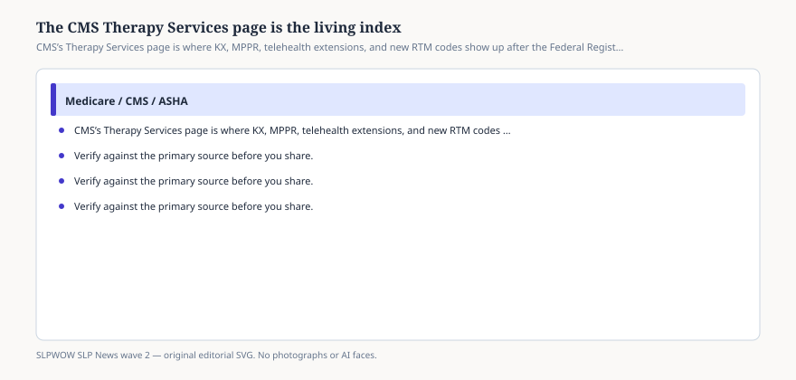

# The CMS Therapy Services page is the living index

*Educational news brief for SLPWOW. Not legal advice, not billing advice, and not a substitute for reading the primary source or for evaluation by a licensed clinician.*

Fee-schedule final rules are novels. The Therapy Services page is the index CMS expects you to reopen. In the 2026 cycle the page did the unglamorous work: it restated the KX amounts, pointed at the MPPR rate file, and then — after Congress finished — wrote the telehealth sentence that clinics will actually quote.

As of the version this desk read, the page says section 6209 of the Consolidated Appropriations Act, 2026, extends the ability of physical therapists, occupational therapists, and speech-language pathologists to furnish telehealth services, including telephone assessment and management codes 98966–98968, through **31 December 2027**. It also says three new remote therapeutic monitoring codes (98979, 98984, 98985) join the list of codes that sometimes or always describe therapy services, with 98976 and 98977 revised.

That is why this brief exists. ASHA news posts move faster. The Federal Register is longer. The Therapy Services page is where those streams are supposed to meet.

## What else lives there

<figure class="slpwow-figure slpwow-figure--infographic" itemscope itemtype="https://schema.org/ImageObject">
  
  <figcaption itemprop="caption">
    <strong>Figure 1.</strong> CMS’s Therapy Services page is where KX, MPPR, telehealth extensions, and new RTM codes show up after the Federal Register fight is over.
    SLPWOW SLP News wave 2 — original SVG. Not legal, billing, or clinical advice.
  </figcaption>
</figure>

The MPPR reminder is older than 2026 and still easy to forget. Since 1 April 2013, the multiple procedure payment reduction on the practice-expense piece of certain always-therapy services is **50 percent** in both office and institutional settings. The highest-PE service of the day pays in full; the rest of the always-therapy stack that day takes the PE cut. CMS posted a CY 2026 MPPR rate file and, in a February 2026 note, added code 97026 to it. If you bill two SLP procedures on the same date, do not be shocked when the second PE slice shrinks.

The page still carries the BBA 2018 origin story for the KX threshold and the targeted-review language. It is a museum and a bulletin board at once. Scroll past the history only after you have confirmed this year’s dollars.

## How to use it in a compliance huddle

Assign one person to open the URL on the first Monday of each month and write three lines: KX number, telehealth sunset, any new code dispositions. That is dull. It is also how you avoid learning about 98984 from a vendor.

Do not treat the page as a substitute for your MAC’s LCD. Do not treat it as compact law. Do not treat a “sometimes therapy” RTM code as an SLP treatment session.

## What to print for the wall

Three lines, dated:

1. KX: $2,480 PT+SLP combined; $2,480 OT (CY 2026).
2. Telehealth practitioner authority: through 31 December 2027 (CAA 2026 §6209).
3. MPPR: 50 percent of PE on the second and later always-therapy codes that day.

Tape MM14315 behind those lines if your biller wants a transmittal number. When CMS revises the page in February again — they already did once for 97026 — reprint the card. A wall that still says January 30, 2026, is a lawsuit with a thumbtack.

## Sources

- CMS, Therapy Services, https://www.cms.gov/medicare/coding-billing/therapy-services
