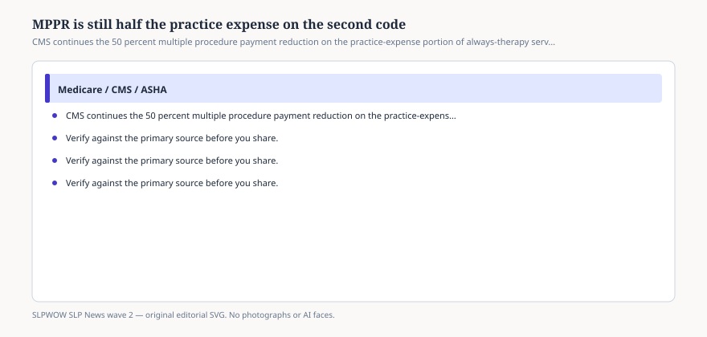

# MPPR is still half the practice expense on the second code

*Educational news brief for SLPWOW. Not legal advice, not billing advice, and not a substitute for reading the primary source or for evaluation by a licensed clinician.*

The multiple procedure payment reduction is not new in 2026. It is newly easy to forget when conversion-factor posts eat the feed. CMS’s Therapy Services page restates the rule: since 1 April 2013, Medicare applies a **50 percent** reduction to the **practice-expense** component of certain always-therapy services when more than one is furnished to the same patient on the same day, in office and institutional settings alike. The service with the highest PE RVU pays fully. The others take the PE haircut. A CY 2026 MPPR rate file sits in the downloads. A February 2026 note added code 97026 to that file.

ASHA’s fee-schedule booklet keeps MPPR on the 2026 policy list. It did not die in the two-conversion-factor rewrite.

## What “always therapy” means in a speech clinic

<figure class="slpwow-figure slpwow-figure--infographic" itemscope itemtype="https://schema.org/ImageObject">
  
  <figcaption itemprop="caption">
    <strong>Figure 1.</strong> CMS continues the 50 percent multiple procedure payment reduction on the practice-expense portion of always-therapy services furnished the same day.
    SLPWOW SLP News wave 2 — original SVG. Not legal, billing, or clinical advice.
  </figcaption>
</figure>

If you bill two always-therapy SLP procedures on one date — an evaluation and a treatment, or two procedures CMS has stacked — do not expect two full PE slices. Work and malpractice RVUs are not what this reduction is about. The PE slice is. Software that shows “the fee” without applying MPPR is lying about the remittance.

The rule is per patient per day, not per clinician ego. Two SLPs in the same group who both bill always-therapy codes to the same beneficiary on Tuesday are in the same stack.

## What MPPR is not

Not a medical-necessity denial. Not a KX issue. Not a compact issue. Not a reason to withhold a needed evaluation because “we already treated.” If the evaluation is indicated, do it and document it. Then accept that Medicare will not pay as if you opened the building twice.

Not a 50 percent cut to the entire line. People say that in meetings. The page says PE component.

## How to talk to a biller who discovered it in 2026

Show the Therapy Services paragraph and the MPPR file. Recalculate a same-day pair. If the second code’s PE is small, the drama will be small. If you live on same-day combinations, the drama is your business model meeting a 2013 rule.

Do not invent extra visits to dodge MPPR. That is a different kind of news, and not the kind this magazine writes.

A same-day evaluation plus treatment is still often the right clinical day. The person drove an hour. The question was new. Do the work, write the two notes, and accept the PE cut. The unethical version is splitting one encounter across two dates because a spreadsheet likes full PE. CMS has seen that movie.

If you share a day with physical therapy in the same group, ask billing whether the always-therapy stack is per discipline or per beneficiary. The Therapy Services sentence is about therapy services to a patient on a day. Do not guess. Ask the MAC if your software vendor shrugs.

## Sources

- CMS, Therapy Services, https://www.cms.gov/medicare/coding-billing/therapy-services
- ASHA, 2026 Medicare Fee Schedule for SLPs, https://www.asha.org/siteassets/reimbursement/2026-medicare-fee-schedule-for-speech-language-pathologists.pdf
