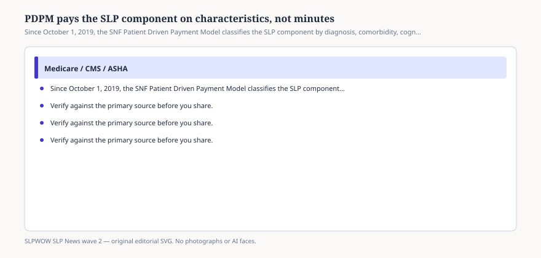

# PDPM pays the SLP component on characteristics, not minutes

*Educational news brief for SLPWOW. Not legal advice, not billing advice, and not a substitute for reading the primary source or for evaluation by a licensed clinician.*

The Patient Driven Payment Model replaced RUG-IV in skilled nursing facilities on **1 October 2019**. It is no longer breaking news. It is still the document SNF administrators misquote when they want fewer speech minutes. Under PDPM, each resident gets a case-mix group in five components: PT, OT, SLP, nursing, and non-therapy ancillary. The SLP component is **not** a minute ladder.

CMS’s own MLN teaching deck listed the SLP classifiers: acute neurologic clinical category, certain SLP-related comorbidities, cognitive impairment, mechanically altered diet, swallowing disorder. ASHA’s SNF page names twelve comorbidity flags that raise the SLP component: aphasia; CVA/TIA/stroke; hemiplegia or hemiparesis; TBI; tracheostomy care while a resident; ventilator or respirator while a resident; laryngeal cancer; apraxia; dysphagia; ALS; oral cancers; speech and language deficits.

Cognition comes from the BIMS or the staff assessment. Swallowing disorder is an MDS K0100 story. Mechanically altered diet is a K-section diet item. Miss those boxes and the building leaves money on the table *and* leaves the swallow invisible.

## Minutes still exist. They do not classify.

<figure class="slpwow-figure slpwow-figure--infographic" itemscope itemtype="https://schema.org/ImageObject">
  
  <figcaption itemprop="caption">
    <strong>Figure 1.</strong> Since October 1, 2019, the SNF Patient Driven Payment Model classifies the SLP component by diagnosis, comorbidity, cognition, diet, and swallow — not therapy minutes.
    SLPWOW SLP News wave 2 — original SVG. Not legal, billing, or clinical advice.
  </figcaption>
</figure>

SNFs still record therapy minutes for other reasons — program integrity, quality, the discharge assessment. They do not buy the SLP case-mix group. A director who says “we cannot afford speech because PDPM pays by the minute” is describing RUG-IV. A director who says “we will not evaluate because the component already paid” is describing a different failure: payment is not a care plan.

The HIPPS code’s second character is the SLP group. CMS published a twelve-group grid (SA through SL) that climbs as neurologic/comorbidity/cognition flags stack with diet and swallow flags. This brief will not reprint the CMI table. Open the CMS deck if you need the numbers.

## Variable per diem is not an SLP fade

PDPM’s variable per-diem adjustments apply to PT/OT and NTA, not as a scheduled fade of the SLP component. Do not tell a family that “speech drops after day 20 because of PDPM.” If speech drops, that is a building decision.

## How to use this in 2026

The model is mature. The news is that it is still the law, and that MDS accuracy is still the SLP’s unglamorous civic duty. Sit with the nurse who codes I8000. Read ASHA’s ICD mapping warning: historical claims data limited which speech-language codes raise the flag. Report the diagnoses you actually found.

A swallow that never makes it onto K0100 is a clinical miss and a payment miss. An “altered diet” that no one can describe in the kitchen is a safety miss. Sit at the tray line once a quarter. The MDS cannot taste the puree.

If a building uses “PDPM” as a verb meaning “cut speech,” ask which component they think they are saving. The SLP component does not fade on a schedule. Cutting the evaluation is how you also miss the comorbidity flag you were theoretically chasing. That is not clever. It is circular.

## Sources

- ASHA, Medicare SNF PPS: Audiology and SLP Services, https://www.asha.org/Practice/reimbursement/medicare/Medicare-Skilled-Nursing-Facility-Prospective-Payment-System/
- CMS, SNF PPS: Patient Driven Payment Model (MLN slides), https://www.cms.gov/medicare/medicare-fee-for-service-payment/snfpps/downloads/mln_call_pdpm_presentation_508.pdf
- CMS, PDPM calculation worksheet (MDS chapter materials), https://www.cms.gov/Medicare/Medicare-Fee-for-Service-Payment/SNFPPS/Downloads/MDS_Manual_Ch6_PDPM_508_corrected.pdf
