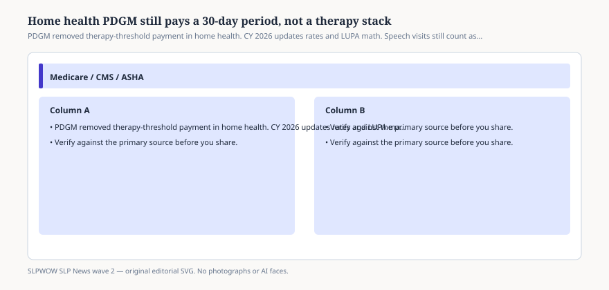

# Home health PDGM still pays a 30-day period, not a therapy stack

*Educational news brief for SLPWOW. Not legal advice, not billing advice, and not a substitute for reading the primary source or for evaluation by a licensed clinician.*

Home health’s Patient-Driven Groupings Model began in calendar year 2020. It replaced a world in which therapy visit counts pulled a case-mix lever. PDGM pays a national 30-day period, adjusted by a 432-group case-mix built from timing, admission source, clinical grouping, functional impairment, and comorbidity — plus wage index, outliers, and the low-utilization payment adjustment. CMS has said, more than once, that PDGM did **not** change eligibility for therapy. If the person qualifies for the home-health benefit, speech-language pathology can still be on the plan.

What changed is the incentive to stack visits for the payment group. The 2026 home-health final rule (CMS-1828-F) is mostly a rate-and-behavior-adjustment story: another update to the 30-day rate, more permanent and temporary adjustments for the difference between assumed and actual PDGM behavior, recalibrated weights, updated LUPA thresholds. MLN MM14304 walks implementers through LUPA add-on factors. Speech-language pathology still has its own add-on factor when a LUPA period’s first visit is SLP (CMS has published 1.6266 in the historical set; confirm the 2026 table in MM14304 before you quote a factor in a memo).

## Why SLPs still get cut from the calendar

<figure class="slpwow-figure slpwow-figure--infographic" itemscope itemtype="https://schema.org/ImageObject">
  
  <figcaption itemprop="caption">
    <strong>Figure 1.</strong> PDGM removed therapy-threshold payment in home health. CY 2026 updates rates and LUPA math. Speech visits still count as care, not as a volume bonus.
    SLPWOW SLP News wave 2 — original SVG. Not legal, billing, or clinical advice.
  </figcaption>
</figure>

Agencies that learned to live without therapy-threshold bonuses sometimes learned the wrong lesson: speech is optional. The regulation CMS keeps citing is 42 CFR 409.42. Coverage is about the person, the homebound rules, and the plan, not about whether SLP “pays extra.” If a patient cannot manage a safe swallow or a way to call for help, that is a clinical grouping and comorbidity problem, not a luxury visit.

OASIS accuracy is the PDGM cousin of the SNF MDS problem. Functional items and comorbidities that never mention communication or swallowing will not summon a speech visit, and they will not price the period as if the problem existed.

## 2026 is a rate year, not a redesign year

Commenters spent 2025 arguing that post-2022 behavior changes were about OASIS-E, value-based purchasing, and Medicare Advantage, not about PDGM cheating. CMS lowered some proposed behavior cuts in the final. That fight is real for agency CFOs. It is not a new definition of speech-language pathology.

## How to talk in an IDT

Ask whether the period is a LUPA. Ask whether the first visit add-on would even be SLP. Ask whether the clinical grouping matches the reason you were called. Do not ask “how many speech visits do we need to hit a threshold.” That threshold is gone.

LUPA periods are the other conversation. If the period is going to land under the visit threshold, the first-visit add-on and the per-visit rates matter more than the 30-day weight. An SLP first visit on a LUPA period is a different arithmetic than an SLP visit stuffed into an already-heavy nursing period. Ask the coder which world you are in before you argue about “the case-mix.”

Medicare Advantage home-health contracts can ignore this entire brief. They are the other payer. See that piece. Do not throw PDGM math at an Advantage case manager and expect applause.

## Sources

- CMS, MM14304, Home Health PPS CY 2026 Rate Update, https://www.cms.gov/files/document/mm14304-home-health-prospective-payment-system-cy-2026-rate-update.pdf
- CMS, CMS-1828-F (CY 2026 HH PPS final rule PDF), https://www.cms.gov/files/document/cms-1828-f.pdf
