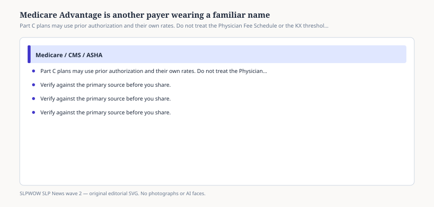

# Medicare Advantage is another payer wearing a familiar name

*Educational news brief for SLPWOW. Not legal advice, not billing advice, and not a substitute for reading the primary source or for evaluation by a licensed clinician.*

Traditional Medicare Part B is the Physician Fee Schedule, the KX threshold, the Therapy Services page. Medicare Advantage (Part C) is a contract. The plan must cover the Medicare benefit, but it may steer, authorize, and price in ways a MAC never did. Clinics that treat “Medicare” as one drawer find out on a denial that the drawer had a false bottom.

This brief will not audit every 2026 Advantage policy. Those PDFs churn by issuer and county. The news is the category error that keeps making the feed: a CMS conversion-factor post is not your United or Humana rate.

## Prior authorization is the usual scar

<figure class="slpwow-figure slpwow-figure--infographic" itemscope itemtype="https://schema.org/ImageObject">
  
  <figcaption itemprop="caption">
    <strong>Figure 1.</strong> Part C plans may use prior authorization and their own rates. Do not treat the Physician Fee Schedule or the KX threshold as the Advantage contract.
    SLPWOW SLP News wave 2 — original SVG. Not legal, billing, or clinical advice.
  </figcaption>
</figure>

Part B therapy does not generally wait on a PA to start medically necessary outpatient speech. Many Advantage plans do. They may also limit visits, demand a specific form, or treat telehealth as a different benefit. CMS has, in other rulemakings, tried to discipline Advantage prior-authorization delays. That federal fuss does not let you skip the plan’s portal this morning.

If a family says “I have Medicare,” ask which card. A red, white, and blue card and an Advantage card are different operational universes.

## Rates and networks

An Advantage plan may approximate PFS rates, undercut them, or bundle you into a post-acute network you never joined. ASHA’s fee-schedule booklet is a Part B document. Using it to yell at an Advantage medical director is a category mistake. Use the participation agreement.

## Compact and Advantage

A compact privilege lets you practice in a member state. It does not enroll you in that state’s Advantage networks. Licensure and credentialing are still two desks.

## How to brief the front desk

“Ask if the therapy benefit is Original Medicare or Advantage. If Advantage, check authorization and in-network status before the evaluation. Do not quote the $2,480 KX number as their cap.”

A family who switched to Advantage in January may still carry the red, white, and blue card in the same wallet. Look at the claim address on the new card. If it is a plan name, it is Part C. If the evaluation already happened, do not start treatment on a verbal “I’m sure we’re fine.” The denial will arrive after the person has already practiced a safe swallow with you, which is a rotten time to discover a network problem.

ASHA’s Part B booklet will not save that claim. The participation agreement might. Read the agreement before the busy season, not after the first stacked denial.

If the plan uses a third-party therapy benefit manager, that logo is the payer for your purposes. CMS did not vanish, but CMS is not answering the prior-auth phone. Call the logo. Document the reference number. Do not tell the family that “Medicare said yes” when a contractor said maybe.

## Sources

- CMS, Therapy Services (Part B therapy rules), https://www.cms.gov/medicare/coding-billing/therapy-services
- ASHA, Medicare FAQs: SLP, https://www.asha.org/practice/reimbursement/medicare/medicare_faqs_slp
