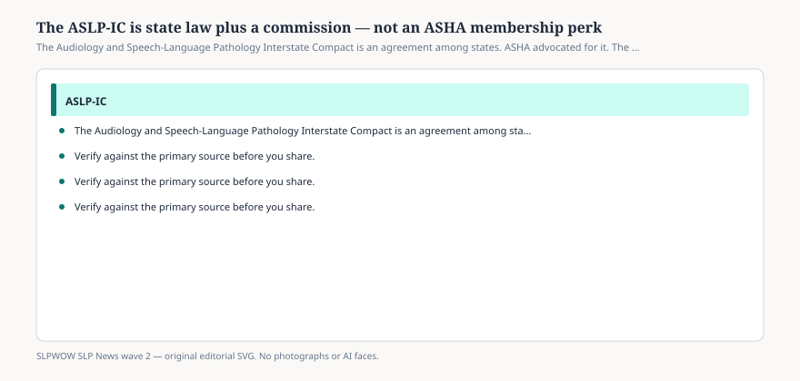

# The ASLP-IC is state law plus a commission — not an ASHA membership perk

*Educational news brief for SLPWOW. Not legal advice, not billing advice, and not a substitute for reading the primary source or for evaluation by a licensed clinician.*

The Audiology & Speech-Language Pathology Interstate Compact is a statute that a legislature enacts, then a commission that writes rules. The public home is aslpcompact.com. ASHA’s Public Policy Agenda asked members to operationalize this compact. That is advocacy. It is not the same as ASHA issuing the privilege.

Under the compact’s own explanation, a clinician who is licensed in good standing in a member home state may become eligible to practice in other member states through a **privilege to practice**, which the Commission describes as equivalent to a license. Practice, the homepage is careful to say, occurs in the state where the patient or client is located at the time of the encounter. Telehealth does not move the patient to your living room.

## Why the distinction matters

<figure class="slpwow-figure slpwow-figure--infographic" itemscope itemtype="https://schema.org/ImageObject">
  
  <figcaption itemprop="caption">
    <strong>Figure 1.</strong> The Audiology and Speech-Language Pathology Interstate Compact is an agreement among states. ASHA advocated for it. The Commission runs it.
    SLPWOW SLP News wave 2 — original SVG. Not legal, billing, or clinical advice.
  </figcaption>
</figure>

People say “I got the compact through ASHA.” They mean they heard about it in an ASHA webinar. The application is CompactConnect. The fee sheet is a Commission PDF. The FBI-background-check gate is in the model legislation and the FAQ. Your CCC is a private credential. Your home-state license is the compact’s on-ramp.

If ASHA disappeared tomorrow, the enacted statutes would still be there until legislatures repealed them. If the Commission stalled, ASHA could still write letters. Keep the letterhead straight.

## What the compact promises the public

The homepage list is continuity of care, military-spouse portability, more access, more choice, a cleaner telehealth path, less paper. Those are design goals. They become real only in states that have both enacted the bill *and* started issuing privileges. The next brief is about that gap.

Committees meet in public. Rules and bylaws are posted. That is how you tell this is a government-adjacent compact and not a membership club.

## What this is not

Not a replacement for Medicare enrollment. Not a malpractice policy. Not a scope expansion. You still practice inside the remote state’s practice act when you are seeing their resident.

ASHA will keep writing “operationalize the compact” in agendas. That verb is useful. It is also how people start to think the association runs CompactConnect. If you are writing a clinic policy, name the Commission URL and the home-state board. Name ASHA only as the lobbyist and the CCC body. Three names, three jobs. A policy that says “follow ASHA compact rules” has named a thing that does not exist.

When a legislator asks whether the compact “lowers standards,” the answer is in the model bill: home-state qualifications, FBI-gate, privilege equivalent to a license, remote-state practice act. That is not a membership perk. It is a statute with teeth if a board wants to use them.

Committee meetings are public. If you want to know why a rule looks the way it does, read the minutes instead of a travel-company thread. The Commission is allowed to be slow. It is not allowed to be secret. That is the difference between a compact and a vendor network.

## Sources

- ASLP-IC Commission, https://aslpcompact.com/
- ASLP-IC FAQ, https://aslpcompact.com/faq/
