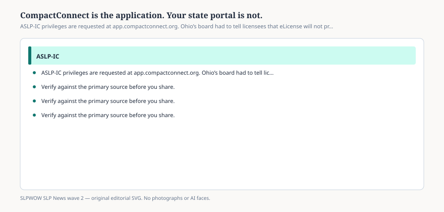

# CompactConnect is the application. Your state portal is not.

*Educational news brief for SLPWOW. Not legal advice, not billing advice, and not a substitute for reading the primary source or for evaluation by a licensed clinician.*

The Commission’s banner is a URL: apply at https://app.compactconnect.org/Dashboard. The FAQ says the privilege is obtained using the CompactConnect data system. Ohio’s board, tired of tickets, posted a FAQ of its own: you cannot apply from the eLicense Ohio dashboard. CompactConnect is a dedicated, secure Commission platform. Register there.

That is the entire product story. There is no ASHA member-login shortcut. There is no MAC shortcut. There is no “my office manager will add the compact like a NPI.”

## Why states built a second door

<figure class="slpwow-figure slpwow-figure--infographic" itemscope itemtype="https://schema.org/ImageObject">
  
  <figcaption itemprop="caption">
    <strong>Figure 1.</strong> ASLP-IC privileges are requested at app.compactconnect.org. Ohio’s board had to tell licensees that eLicense will not process the compact.
    SLPWOW SLP News wave 2 — original SVG. Not legal, billing, or clinical advice.
  </figcaption>
</figure>

A compact has to move licensure status, disciplinary flags, and privilege records among members without handing FBI rap sheets to the Commission. The model legislation forbids sharing FBI criminal-record information through the compact communications channel. A shared system that is *not* your state’s old license app is how they tried to do that. Onboarding a state means loading its licensees into that system and flipping the issuing switch. Until the switch flips, the door is a 404 for that board.

## What to do on day one

Create the CompactConnect account yourself. Do not give a recruiter your password. Confirm your home state is issuing. Confirm the remote state is issuing. Pay the fees the current PDF lists. Complete jurisprudence if the row requires it. Download whatever privilege evidence the system gives you and keep it with the license wallet you already show to facilities.

If the dashboard says you are ineligible, believe it long enough to call the home board. Do not invent a workaround on a forum.

## Security is not a vibe

This is a credentialing system attached to state boards. Treat it like a DEA login, not like a continuing-education cart. Phishing that says “update your compact privilege” should be treated as hostile.

If CompactConnect and your wallet card disagree, the dashboard is the thing a remote board will query. Print or save the privilege evidence the day it issues. Facilities will ask for it the way they ask for a license PDF, and they will not wait while you reset a password in a hotel.

Recruiters who offer to “handle CompactConnect for you” are offering to hold a government-adjacent login. Decline. The Ohio board already had to say the state portal will not do this. A staffing company is not a better portal.

If you lose access to the email you used at registration, fix it before you move states. Privilege renewals will go to that inbox. A dead student email is how people discover they are unauthorized in week eleven of a contract.

Use a password manager. Do not tape the password to a travel laptop. CompactConnect is closer to a board portal than to a CE cart, and it should be treated that way on day one, not after a theft.

## Sources

- ASLP-IC Commission, https://aslpcompact.com/
- CompactConnect dashboard, https://app.compactconnect.org/Dashboard
- Ohio SHP Board, Interstate Compact, https://shp.ohio.gov/wps/portal/gov/shp/getting-licensed/interstate/interstate-compact
