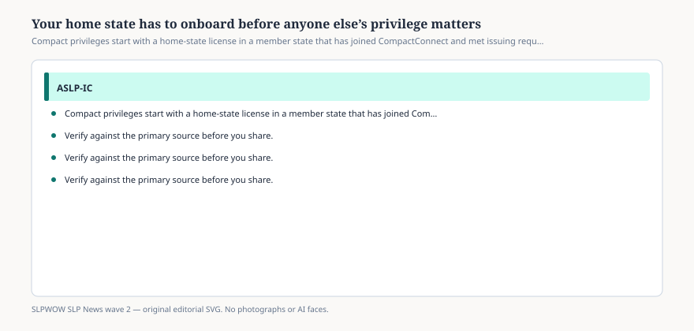

# Your home state has to onboard before anyone else’s privilege matters

*Educational news brief for SLPWOW. Not legal advice, not billing advice, and not a substitute for reading the primary source or for evaluation by a licensed clinician.*

The Commission’s FAQ is almost rude in its simplicity. Your home state must be an ASLP-IC member. A state must pass the bill, onboard with CompactConnect, and then it can issue and receive privileges. When will *your* home state start? Ask your board.

That last sentence is the only official timeline for most of the map. The home page will not give you a private ETA. This magazine will not invent one.

## Home state is a legal word

<figure class="slpwow-figure slpwow-figure--infographic" itemscope itemtype="https://schema.org/ImageObject">
  
  <figcaption itemprop="caption">
    <strong>Figure 1.</strong> Compact privileges start with a home-state license in a member state that has joined CompactConnect and met issuing requirements. The FAQ says to ask your board.
    SLPWOW SLP News wave 2 — original SVG. Not legal, billing, or clinical advice.
  </figcaption>
</figure>

In compact English, home state is the member state that issued the license you are using as the base — typically the state of residence and primary license. You cannot home-state out of a non-member because the work is nicer in a member. You cannot home-state out of an enacted-but-dark board and privilege into Tennessee as if Tennessee were your parent. Tennessee can receive privileges from issuing homes. It cannot adopt you.

The October 2023 FAQ PDF describes “initial privilege to practice” as the home state’s verification of education, examination, and criminal history. Those steps are completed at home. The remote state then looks, through the data system, for other licenses, encumbrances, and adverse actions.

## What to ask the board, in writing

1. Have we enacted?
2. Are we on CompactConnect?
3. Are we issuing and receiving, or only one of those?
4. Do I need a new FBI print because of my original license date?
5. Whom do I email when CompactConnect and the state roster disagree?

Save the reply. Credentialing offices collect those emails.

## Travel companies

A company that only hires from the four issuing homes is being honest. A company that says “any compact state” in September 2026 is reading last year’s legislative scorecard. Ask which number they mean: enacted or issuing.

People with two state licenses sometimes ask which one can be home. That is a board-and-statute question, not a magazine question. The usual compact idea is one primary home. Do not invent a dual-home theory on a forum. Email both boards and keep the answers.

If you are a student or a fellow, you do not have a compact home yet. Finish the license. The compact is not a trainee passport. It is a licensee passport, and only after the home machine is on.

If your board’s voicemail says “see the Commission,” and the Commission’s form says “see your board,” write both and keep the timestamps. That loop is itself a data point about whether the state is actually onboarded. A live issuing state answers with a URL.

## Sources

- ASLP-IC Commission, https://aslpcompact.com/
- ASLP-IC FAQ, https://aslpcompact.com/faq/
- ASLP-IC Compact Map, https://aslpcompact.com/compact-map/
- ASLP-IC FAQ PDF (7 October 2023), https://aslpcompact.com/wp-content/uploads/2023/10/ASLP-IC-Frequently-Asked-Questions-10-7-23.pdf
