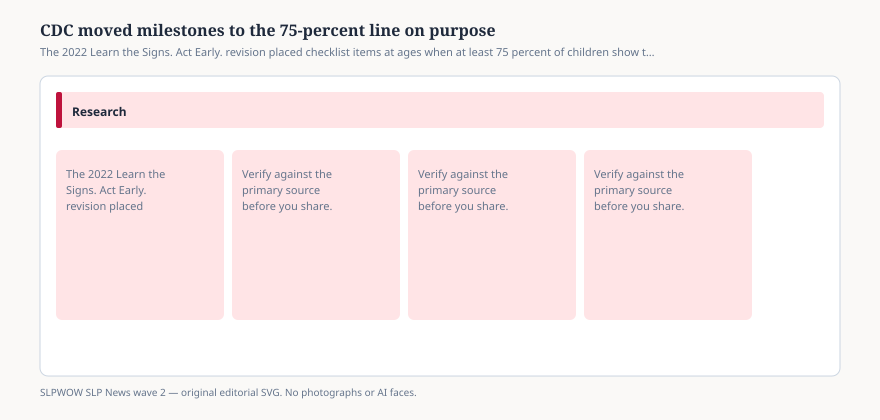

# CDC moved milestones to the 75-percent line on purpose

*Educational news brief for SLPWOW. Not legal advice, not billing advice, and not a substitute for reading the primary source or for evaluation by a licensed clinician.*

In February 2022 the CDC Learn the Signs. Act Early. program released revised developmental-milestone checklists. The methods paper behind the revision — Zubler and colleagues in *Pediatrics* — is the document to read when a headline says CDC “delayed speech milestones.” The working group funded through AAP did not aim at the median child. They aimed at the age when **most** children (≥75 percent) would be expected to show a skill, and at skills a caregiver can see in a kitchen.

The point, CDC still says on its Act Early “about” page, was to stop “wait and see” when a listed item is missing. If half of children would not yet do the thing, missing it is normal. If three-quarters should already do it, missing it is a conversation.

## What else changed besides the percentile

<figure class="slpwow-figure slpwow-figure--infographic" itemscope itemtype="https://schema.org/ImageObject">
  
  <figcaption itemprop="caption">
    <strong>Figure 1.</strong> The 2022 Learn the Signs. Act Early. revision placed checklist items at ages when at least 75 percent of children show the skill. It is surveillance, not a diagnosis.
    SLPWOW SLP News wave 2 — original SVG. Not legal, billing, or clinical advice.
  </figcaption>
</figure>

The revision added 15- and 30-month checklists so the ages match AAP health-supervision visits. It dropped duplicate items that had repeated across ages. It tried to show a progression instead of a pile. The methods paper quantified the churn: about 26 percent of old milestones removed, about 41 percent replaced, a third of the keepers moved in age, and most of those movers went **older**. Social-emotional and cognitive items had the thinnest normative data. That last sentence is how you talk to a pediatrician who thinks the list is a normed test. It is not.

LTSAE is surveillance and family education. Screening is a different act, with a different instrument, at recommended ages. Evaluation is a third act. Wave 1 of this series already drew that card. Wave 2 is here because the 75-percent rule keeps getting retold as “CDC says talking later is fine.”

## What a missed item is

A reason to talk to the child’s clinician and to ask about screening. Not a diagnosis of developmental language disorder. Not an IEP. Not a reason to start a home program you found on a shoppable PDF. If communication or swallowing is the worry, ASHA’s later comment (next brief) is that families should also find an SLP.

## What this is not

Not ASHA’s checklist. ASHA was not on the working group. Not a bilingual assessment. Not a substitute for hearing testing. Not a billing code.

A useful sentence for a well-child huddle: “This list is built so a missed item is uncommon, not average. If it is missed, we talk. If the caregiver is worried and the list is green, we still talk.” That second clause is how you keep CDC’s anti-wait-and-see intent without turning the app into an oracle.

Print the current CDC PDF, not a 2019 photocopy in a drawer. The 15- and 30-month pages exist because the visits exist. Using an old list is how a clinic accidentally practices last decade’s surveillance.

## Sources

- CDC, About Learn the Signs. Act Early., https://www.cdc.gov/act-early/about/index.html
- Zubler et al., “Evidence-Informed Milestones for Developmental Surveillance Tools,” *Pediatrics* 2022, https://pmc.ncbi.nlm.nih.gov/articles/PMC9680195/
- CDC, LTSAE overview article (PMC10193264), https://pmc.ncbi.nlm.nih.gov/articles/PMC10193264/
