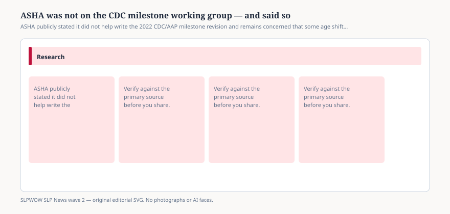

# ASHA was not on the CDC milestone working group — and said so

*Educational news brief for SLPWOW. Not legal advice, not billing advice, and not a substitute for reading the primary source or for evaluation by a licensed clinician.*

After the February 2022 checklist drop, ASHA members filled inboxes. The association’s public comment page is the artifact. ASHA was **not** involved in the revised milestones. Staff met with CDC and AAP afterward. The page relays what those agencies wanted members to hear, then adds ASHA’s own residual worry: some age changes may **slow or inhibit referrals** to early intervention.

That is a professional association disagreeing with a surveillance tool without calling the tool fake. Hold both facts.

## What ASHA did not deny

<figure class="slpwow-figure slpwow-figure--infographic" itemscope itemtype="https://schema.org/ImageObject">
  
  <figcaption itemprop="caption">
    <strong>Figure 1.</strong> ASHA publicly stated it did not help write the 2022 CDC/AAP milestone revision and remains concerned that some age shifts will slow early-intervention referrals.
    SLPWOW SLP News wave 2 — original SVG. Not legal, billing, or clinical advice.
  </figcaption>
</figure>

The checklists are surveillance, not screening, not evaluation. They can sit beside other tools. Families should still act on concern. Hearing belongs to audiology. Communication and swallowing concerns in a 1- to 5-year-old are a reason to find an SLP even when the child does not yet “qualify” for a program. ASHA’s stated goal on that page is children entering kindergarten with the communication they need to learn — a civic sentence, not a test cutoff.

## What the disagreement is about

If you move a talking item later so that 75 percent of children already do it, you also move the age at which a primary-care office is told to worry. CDC thinks that reduces false calm at the median. ASHA thinks some children who would have been referred under the old ages will now wait. Both can be true for different children. The fix is not a flame war. The fix is: missed item or caregiver concern → conversation → screen → refer. Do not let a checklist win against a parent who is worried.

## How a clinic should talk

“CDC’s list is a surveillance aid. It is not my evaluation. ASHA did not write it and has published concerns about referral timing. If you are worried, we do not wait for the app to turn red.”

Do not tell families ASHA “rejected the CDC milestones.” The page is more careful than that. Do not tell them ASHA secretly wrote the list. The page denies it.

Early-intervention intake workers should hear the practical version. A pediatrician who waits because a 2022 item moved later may send you a quieter referral stream. That is ASHA’s fear, written down. Your counter is not a flame about CDC. It is an open door: caregiver concern counts, hearing counts, and an SLP can look before a program “qualifies” anyone.

If you teach graduate diagnostics, assign the ASHA page and the Zubler paper in the same week. Students need to see a methods article and a professional dissent without being told to pick a team.

Parents who found this magazine after a Facebook fight can stop here: two serious organizations published different worries about the same checklist. Your child is not a team. If you are concerned, get a person in a room — pediatrician, SLP, audiologist — and bring the current CDC list as a conversation starter, not as a verdict.

## Sources

- ASHA, comments on CDC and AAP developmental milestones updates, https://www.asha.org/practice/asha-comments-on-aap-and-cdc-developmental-milestones-updates
- CDC, About Learn the Signs. Act Early., https://www.cdc.gov/act-early/about/index.html
