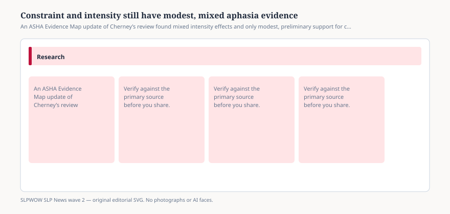

# Constraint and intensity still have modest, mixed aphasia evidence

*Educational news brief for SLPWOW. Not legal advice, not billing advice, and not a substitute for reading the primary source or for evaluation by a licensed clinician.*

Constraint-induced language therapy has a brand energy that the evidence does not share. The ASHA Evidence Map still carries an updated systematic review that began as Cherney and colleagues 2008 in *JSLHR* and then added later trials. The map’s own prose is the right temperature.

On **intensity**, the original review saw a modest signal that more hours helped language-impairment scores. The update, with more studies, found **mixed** impairment results. The authors say so: this differs from the first paper, where most studies had tied more treatment to better impairment scores. Small N, uneven methods, mixed people.

On **CILT**, the update found 13 newer studies for impairment, six of which also looked at activity and participation, four at maintenance. Two efficacy studies favored CILT on some language and participation measures. Exploratory studies were mixed. The conclusion did not upgrade. **Modest** evidence, **preliminary**, because the pile is still small and messy.

## What a program director should stop saying

<figure class="slpwow-figure slpwow-figure--infographic" itemscope itemtype="https://schema.org/ImageObject">
  
  <figcaption itemprop="caption">
    <strong>Figure 1.</strong> An ASHA Evidence Map update of Cherney’s review found mixed intensity effects and only modest, preliminary support for constraint-induced language therapy.
    SLPWOW SLP News wave 2 — original SVG. Not legal, billing, or clinical advice.
  </figcaption>
</figure>

“We do constraint because it’s the gold standard.” The map will not say that, and this magazine is not allowed to either. “We do intensive because more is always better.” The update took that slogan away. “We do intensive constraint via telehealth because two reviews exist.” Stacking two modest piles does not make a tower.

What you may say: some people improve with these approaches; the comparisons are not clean; we will measure the person in front of us; we will not withhold a useful life-participation task because it is not “constrained.”

## Payers and hours

A Medicare Advantage visit cap is not a CILT protocol. A SNF that cut speech because PDPM “doesn’t pay minutes” is not following this review. Intensity research is about dose in trials. It is not a billing appendix.

## How to read the map card

Open the ASHA summary. If you need the forest plot, get the journal article through a library. Do not scrape ASHA’s HTML into a clinic wiki as if it were your protocol. Do not tell a family their spouse failed because you did not shout.

If a funder wants “evidence-based intensity,” give them the update’s mixed paragraph and then give them the person’s stamina, transportation, and life-participation goals. A six-hour constraint day that leaves someone too tired to eat with a grandchild is not automatically the scientific choice. Modest, preliminary, mixed — those adjectives are the finding. Programs that cannot say them should not cite the review.

If you still like constraint as a tool some weeks, keep it as a tool. Drop the brand energy. Measure participation, not just a naming score, if the review’s activity-and-participation hole is the reason the family came. Then stop when the person is done, not when the protocol booklet still has a page.

## Sources

- ASHA Evidence Map summary, updated intensity and CILT review, https://apps.asha.org/EvidenceMaps/Articles/ArticleSummary/42f5de60-ac6f-41a3-9b0a-5399a43c4325
- ASHA Evidence Map, Telepractice (related remote CILT notes live nearby), https://apps.asha.org/EvidenceMaps/Maps/LandingPage/f8eee3d9-4739-4ba6-b925-5d2f3ad809b6
