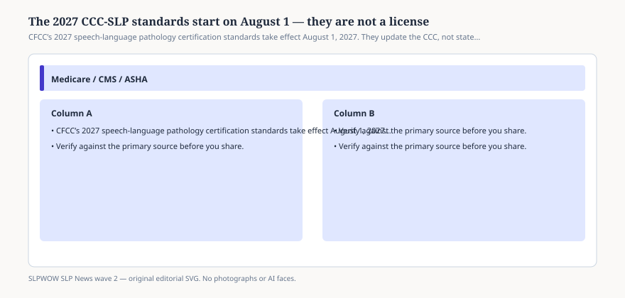

# Embed — 2027-standards-start-august

```html
<figure class="slpwow-figure slpwow-figure--infographic" itemscope itemtype="https://schema.org/ImageObject">
  
  <figcaption itemprop="caption">
    <strong>Figure 1.</strong> CFCC’s 2027 speech-language pathology certification standards take effect August 1, 2027. They update the CCC, not state licensure or Medicare.
    <span class="figure-credit">SLPWOW SLP News wave 2 — original SVG. Not legal, billing, or clinical advice.</span>
  </figcaption>
</figure>
```
