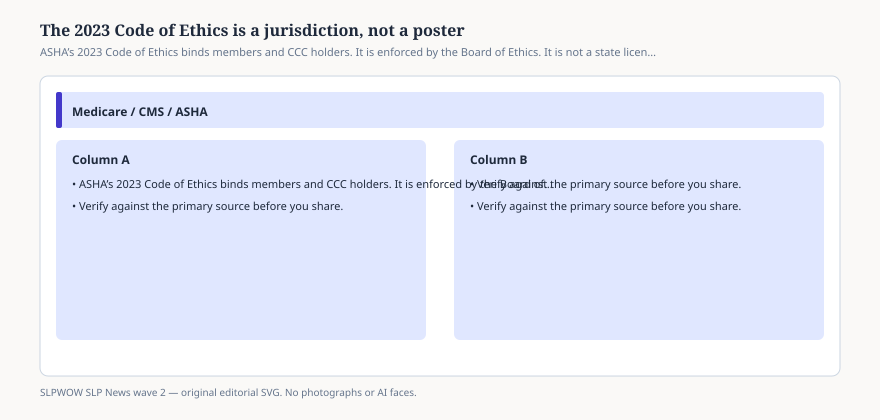

# Embed — code-of-ethics-is-not-a-poster

```html
<figure class="slpwow-figure slpwow-figure--infographic" itemscope itemtype="https://schema.org/ImageObject">
  
  <figcaption itemprop="caption">
    <strong>Figure 1.</strong> ASHA’s 2023 Code of Ethics binds members and CCC holders. It is enforced by the Board of Ethics. It is not a state license and not a billing manual.
    <span class="figure-credit">SLPWOW SLP News wave 2 — original SVG. Not legal, billing, or clinical advice.</span>
  </figcaption>
</figure>
```
