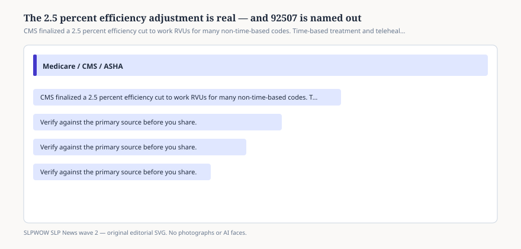

# Embed — efficiency-adjustment-exempts-92507

```html
<figure class="slpwow-figure slpwow-figure--infographic" itemscope itemtype="https://schema.org/ImageObject">
  
  <figcaption itemprop="caption">
    <strong>Figure 1.</strong> CMS finalized a 2.5 percent efficiency cut to work RVUs for many non-time-based codes. Time-based treatment and telehealth-list services, including 92507, are exempt.
    <span class="figure-credit">SLPWOW SLP News wave 2 — original SVG. Not legal, billing, or clinical advice.</span>
  </figcaption>
</figure>
```
