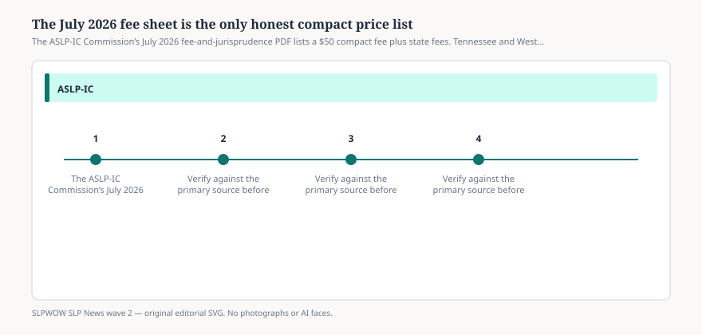

# Embed — fees-and-jurisprudence

```html
<figure class="slpwow-figure slpwow-figure--infographic" itemscope itemtype="https://schema.org/ImageObject">
  
  <figcaption itemprop="caption">
    <strong>Figure 1.</strong> The ASLP-IC Commission’s July 2026 fee-and-jurisprudence PDF lists a $50 compact fee plus state fees. Tennessee and West Virginia require jurisprudence; Ohio and Louisiana did not.
    <span class="figure-credit">SLPWOW SLP News wave 2 — original SVG. Not legal, billing, or clinical advice.</span>
  </figcaption>
</figure>
```
