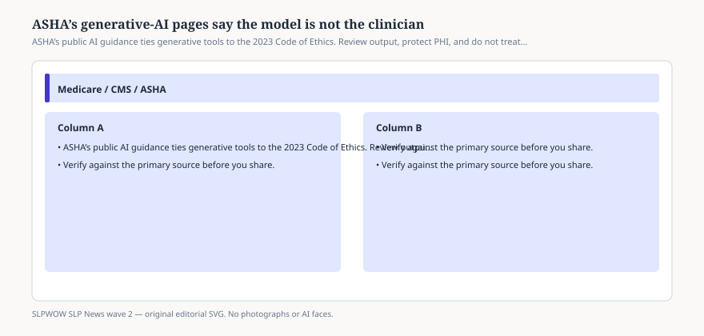

# Embed — generative-ai-cannot-replace-the-clinician

```html
<figure class="slpwow-figure slpwow-figure--infographic" itemscope itemtype="https://schema.org/ImageObject">
  
  <figcaption itemprop="caption">
    <strong>Figure 1.</strong> ASHA’s public AI guidance ties generative tools to the 2023 Code of Ethics. Review output, protect PHI, and do not treat a scribe as a signer.
    <span class="figure-credit">SLPWOW SLP News wave 2 — original SVG. Not legal, billing, or clinical advice.</span>
  </figcaption>
</figure>
```
