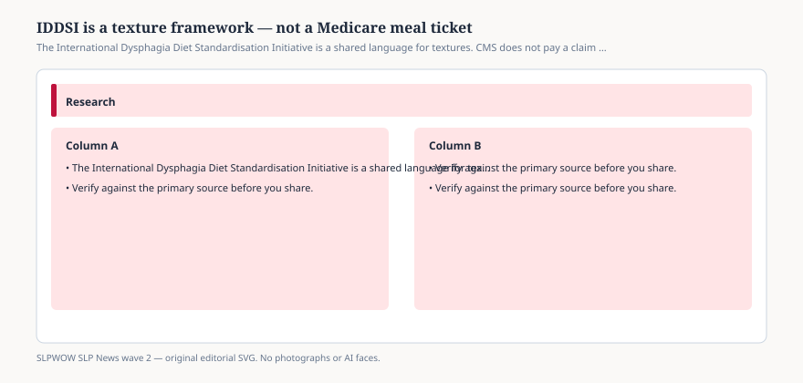

# Embed — iddsi-is-not-a-cms-diet

```html
<figure class="slpwow-figure slpwow-figure--infographic" itemscope itemtype="https://schema.org/ImageObject">
  
  <figcaption itemprop="caption">
    <strong>Figure 1.</strong> The International Dysphagia Diet Standardisation Initiative is a shared language for textures. CMS does not pay a claim because a tray is labeled Level 4.
    <span class="figure-credit">SLPWOW SLP News wave 2 — original SVG. Not legal, billing, or clinical advice.</span>
  </figcaption>
</figure>
```
