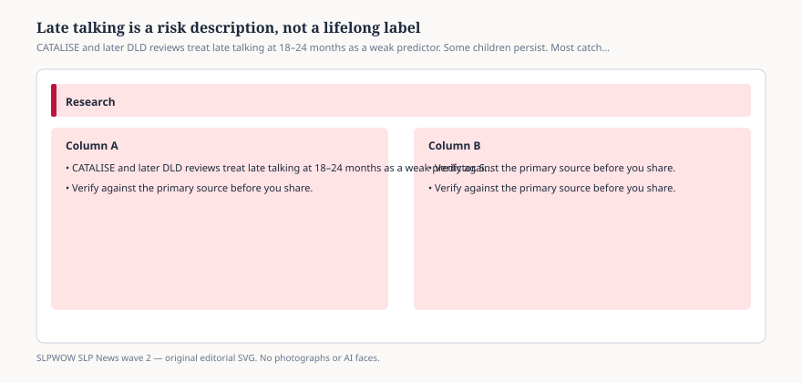

# Embed — late-talkers-are-not-a-diagnosis

```html
<figure class="slpwow-figure slpwow-figure--infographic" itemscope itemtype="https://schema.org/ImageObject">
  
  <figcaption itemprop="caption">
    <strong>Figure 1.</strong> CATALISE and later DLD reviews treat late talking at 18–24 months as a weak predictor. Some children persist. Most catch up. Reassessment beats a slogan.
    <span class="figure-credit">SLPWOW SLP News wave 2 — original SVG. Not legal, billing, or clinical advice.</span>
  </figcaption>
</figure>
```
