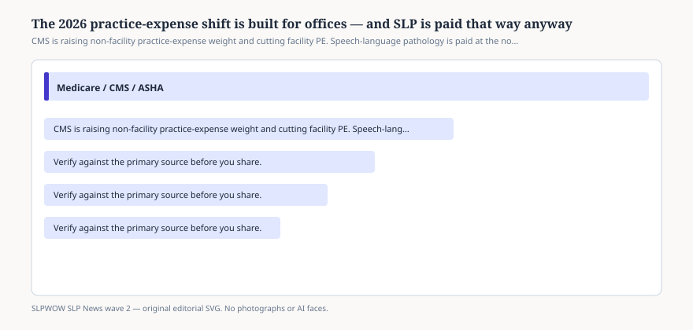

# Embed — nonfacility-pe-helps-slp

```html
<figure class="slpwow-figure slpwow-figure--infographic" itemscope itemtype="https://schema.org/ImageObject">
  
  <figcaption itemprop="caption">
    <strong>Figure 1.</strong> CMS is raising non-facility practice-expense weight and cutting facility PE. Speech-language pathology is paid at the non-facility rate by law, so the shift is a small tailwind.
    <span class="figure-credit">SLPWOW SLP News wave 2 — original SVG. Not legal, billing, or clinical advice.</span>
  </figcaption>
</figure>
```
