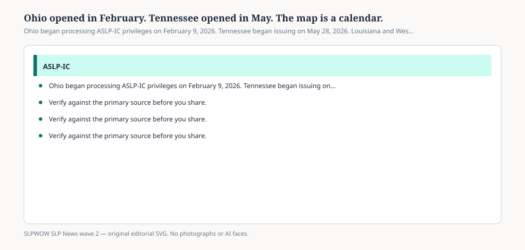

# Embed — ohio-feb-tennessee-may

```html
<figure class="slpwow-figure slpwow-figure--infographic" itemscope itemtype="https://schema.org/ImageObject">
  
  <figcaption itemprop="caption">
    <strong>Figure 1.</strong> Ohio began processing ASLP-IC privileges on February 9, 2026. Tennessee began issuing on May 28, 2026. Louisiana and West Virginia had opened earlier.
    <span class="figure-credit">SLPWOW SLP News wave 2 — original SVG. Not legal, billing, or clinical advice.</span>
  </figcaption>
</figure>
```
