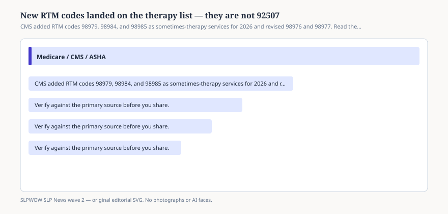

# Embed — rtm-sometimes-therapy

```html
<figure class="slpwow-figure slpwow-figure--infographic" itemscope itemtype="https://schema.org/ImageObject">
  
  <figcaption itemprop="caption">
    <strong>Figure 1.</strong> CMS added RTM codes 98979, 98984, and 98985 as sometimes-therapy services for 2026 and revised 98976 and 98977. Read the descriptors before anyone markets a dashboard.
    <span class="figure-credit">SLPWOW SLP News wave 2 — original SVG. Not legal, billing, or clinical advice.</span>
  </figcaption>
</figure>
```
