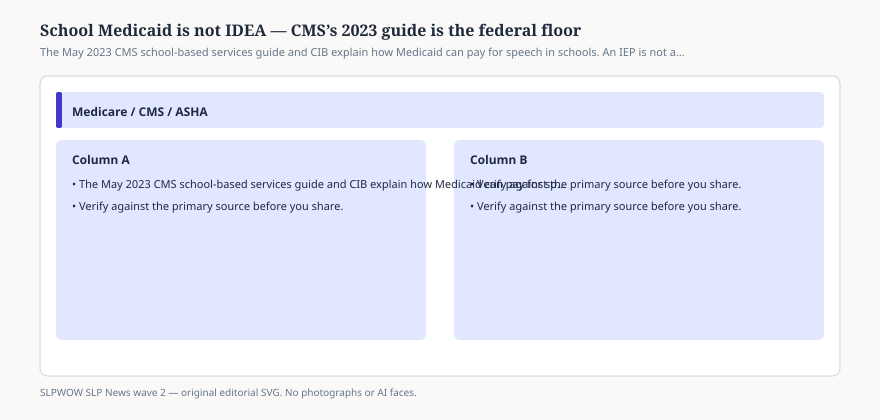

# Embed — school-medicaid-2023-guide

```html
<figure class="slpwow-figure slpwow-figure--infographic" itemscope itemtype="https://schema.org/ImageObject">
  
  <figcaption itemprop="caption">
    <strong>Figure 1.</strong> The May 2023 CMS school-based services guide and CIB explain how Medicaid can pay for speech in schools. An IEP is not automatically a claim.
    <span class="figure-credit">SLPWOW SLP News wave 2 — original SVG. Not legal, billing, or clinical advice.</span>
  </figcaption>
</figure>
```
