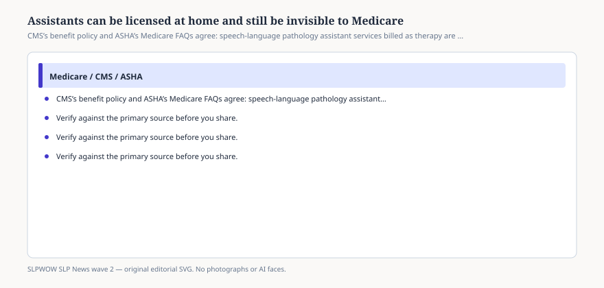

# Embed — slpa-and-the-medicare-gap

```html
<figure class="slpwow-figure slpwow-figure--infographic" itemscope itemtype="https://schema.org/ImageObject">
  
  <figcaption itemprop="caption">
    <strong>Figure 1.</strong> CMS’s benefit policy and ASHA’s Medicare FAQs agree: speech-language pathology assistant services billed as therapy are not covered. State licensure does not fix that.
    <span class="figure-credit">SLPWOW SLP News wave 2 — original SVG. Not legal, billing, or clinical advice.</span>
  </figcaption>
</figure>
```
