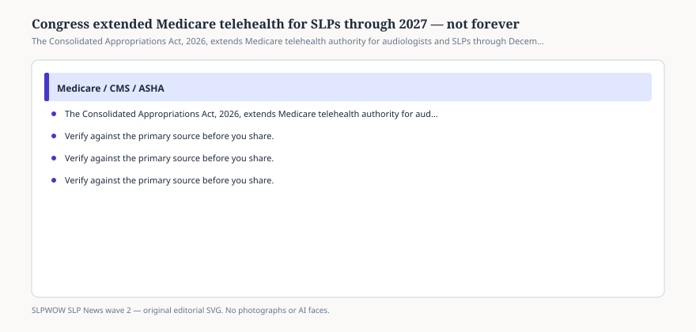

# Embed — telehealth-through-2027-not-forever

```html
<figure class="slpwow-figure slpwow-figure--infographic" itemscope itemtype="https://schema.org/ImageObject">
  
  <figcaption itemprop="caption">
    <strong>Figure 1.</strong> The Consolidated Appropriations Act, 2026, extends Medicare telehealth authority for audiologists and SLPs through December 31, 2027. ASHA still wants permanence.
    <span class="figure-credit">SLPWOW SLP News wave 2 — original SVG. Not legal, billing, or clinical advice.</span>
  </figcaption>
</figure>
```
