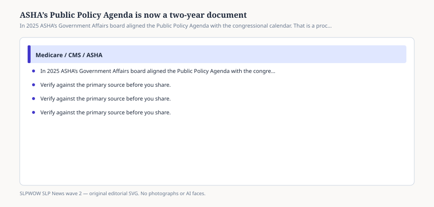

# Embed — the-ppa-is-now-biennial

```html
<figure class="slpwow-figure slpwow-figure--infographic" itemscope itemtype="https://schema.org/ImageObject">
  
  <figcaption itemprop="caption">
    <strong>Figure 1.</strong> In 2025 ASHA’s Government Affairs board aligned the Public Policy Agenda with the congressional calendar. That is a process change, not a new statute.
    <span class="figure-credit">SLPWOW SLP News wave 2 — original SVG. Not legal, billing, or clinical advice.</span>
  </figcaption>
</figure>
```
