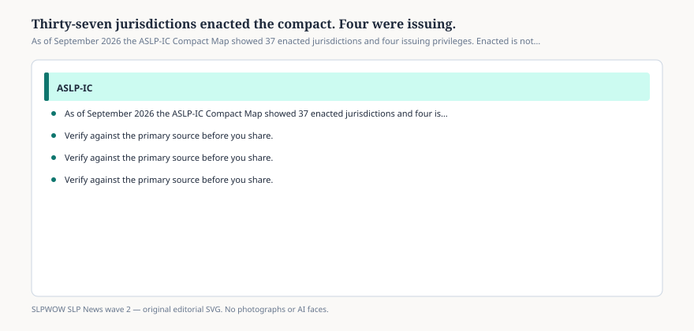

# Embed — thirty-seven-and-four

```html
<figure class="slpwow-figure slpwow-figure--infographic" itemscope itemtype="https://schema.org/ImageObject">
  
  <figcaption itemprop="caption">
    <strong>Figure 1.</strong> As of September 2026 the ASLP-IC Compact Map showed 37 enacted jurisdictions and four issuing privileges. Enacted is not operational.
    <span class="figure-credit">SLPWOW SLP News wave 2 — original SVG. Not legal, billing, or clinical advice.</span>
  </figcaption>
</figure>
```
