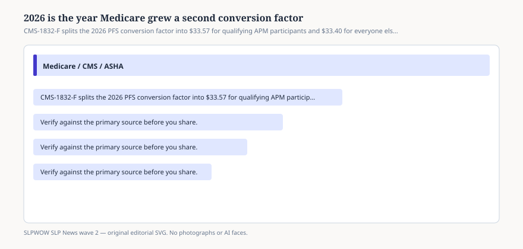

# Embed — two-conversion-factors

```html
<figure class="slpwow-figure slpwow-figure--infographic" itemscope itemtype="https://schema.org/ImageObject">
  
  <figcaption itemprop="caption">
    <strong>Figure 1.</strong> CMS-1832-F splits the 2026 PFS conversion factor into $33.57 for qualifying APM participants and $33.40 for everyone else. Most SLPs use the second number.
    <span class="figure-credit">SLPWOW SLP News wave 2 — original SVG. Not legal, billing, or clinical advice.</span>
  </figcaption>
</figure>
```
