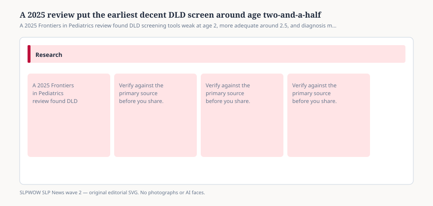

# Embed — when-to-screen-for-dld-2025

```html
<figure class="slpwow-figure slpwow-figure--infographic" itemscope itemtype="https://schema.org/ImageObject">
  
  <figcaption itemprop="caption">
    <strong>Figure 1.</strong> A 2025 Frontiers in Pediatrics review found DLD screening tools weak at age 2, more adequate around 2.5, and diagnosis more stable by 4.
    <span class="figure-credit">SLPWOW SLP News wave 2 — original SVG. Not legal, billing, or clinical advice.</span>
  </figcaption>
</figure>
```
