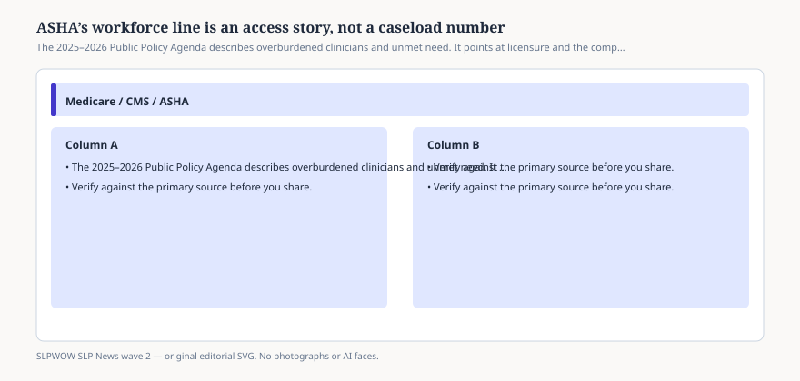

# Embed — workforce-is-an-access-story

```html
<figure class="slpwow-figure slpwow-figure--infographic" itemscope itemtype="https://schema.org/ImageObject">
  
  <figcaption itemprop="caption">
    <strong>Figure 1.</strong> The 2025–2026 Public Policy Agenda describes overburdened clinicians and unmet need. It points at licensure and the compact, not a national caseload cap.
    <span class="figure-credit">SLPWOW SLP News wave 2 — original SVG. Not legal, billing, or clinical advice.</span>
  </figcaption>
</figure>
```
