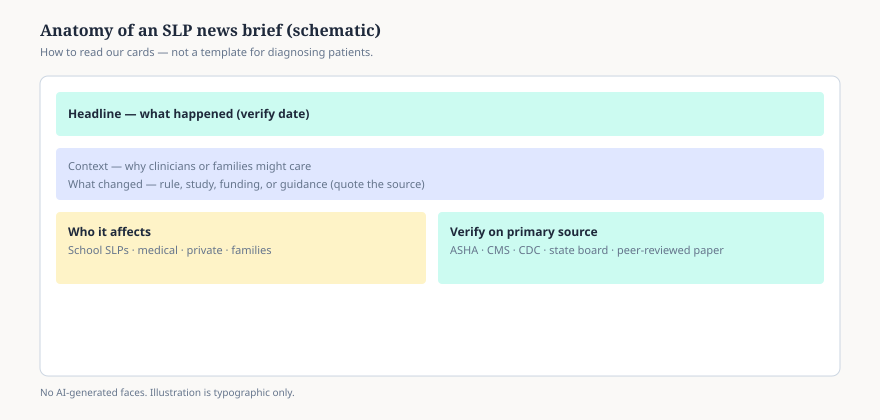

**Disclaimer.** Educational news literacy for clinicians and informed families. Not legal advice, not billing advice, and not a substitute for reading primary sources.

A good SLP headline is loud. Primary sources are quiet. Our briefs try to hold both.

## What we put on the card

We label five zones (see figure): the **headline claim**, the **context**, the **document that actually changed**, **who is affected**, and **where to verify**. If a viral post skips the third box, we treat it as unfinished homework.

## What we do not do

We do not diagnose children from news items. We do not tell you to change caseloads based on a screenshot. We do not use synthetic faces in figures — typography and schematics only.

When you finish a brief, open the linked ASHA, CMS, CDC, or state board page. If the primary source disagrees with the summary, the primary source wins.

<figure class="slpwow-figure slpwow-figure--infographic" itemscope itemtype="https://schema.org/ImageObject">
  
  <figcaption itemprop="caption">
    <strong>Figure 1.</strong> Anatomy of a news brief (schematic). SLPWOW news pieces separate headline heat from verifiable policy or research changes and name who is affected.
    SLPWOW SLP News — original editorial SVG. Not legal or clinical advice.
  </figcaption>
</figure>
