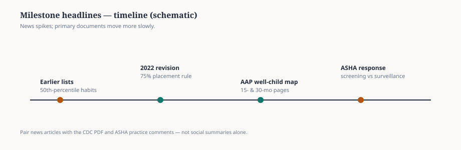

**Disclaimer.** Educational only. Not a developmental screen and not medical advice.

Every few years the CDC milestone checklists return to the news cycle. The 2022 revision moved items to ages where at least **75%** of children in the reference data showed the skill — a surveillance tool meant to prompt conversations, not a diagnostic label.

ASHA’s public comments remind readers that milestone lists are not the same instruments clinicians use for standardized screening. That tension is real and worth reading in full.

Use the timeline figure as a map, then open the current CDC PDF and ASHA’s practice comments before you change referral language in your district or practice.

<figure class="slpwow-figure slpwow-figure--timeline" itemscope itemtype="https://schema.org/ImageObject">
  
  <figcaption itemprop="caption">
    <strong>Figure 1.</strong> Milestone headlines in context (schematic timeline). Revised CDC lists and professional commentary are different artifacts — read both before changing referral habits.
    SLPWOW SLP News — original editorial SVG. Verify dates against CDC and ASHA primary pages.
  </figcaption>
</figure>
