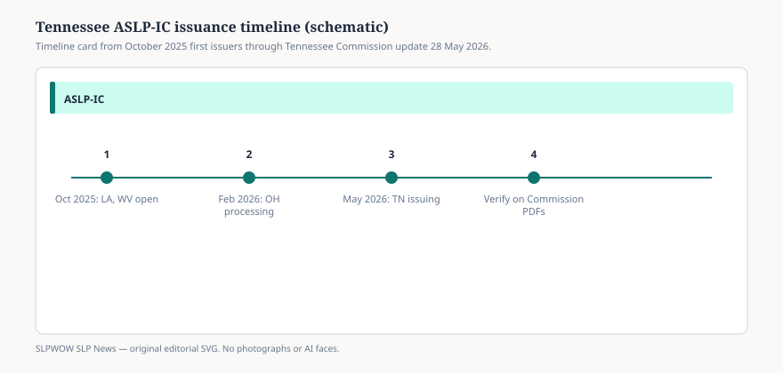

# Tennessee is issuing ASLP-IC privileges as of 28 May 2026

NASHVILLE — May 28, 2026 — The Audiology and Speech-Language Pathology Interstate Compact Commission changed its home page on 28 May 2026 with one operational sentence: Tennessee is now issuing privileges to practice. The same update says registration is open for licensed practitioners in Louisiana, Ohio, Tennessee, and West Virginia.

That is a four-state issuing column. It is not a 37-jurisdiction mobility system. The Compact Map still keeps the rest of the membership in other buckets: enacted but not issuing, active legislation, and no active legislation.

## What the May 28 line added

<figure class="slpwow-figure slpwow-figure--infographic" itemscope itemtype="https://schema.org/ImageObject">
  
  <figcaption itemprop="caption">
    <strong>Figure 1.</strong> Tennessee joined the issuing column on the Commission’s 28 May 2026 notice.
    SLPWOW SLP News — original editorial SVG. Not legal, billing, or clinical advice.
  </figcaption>
</figure>

Louisiana and West Virginia opened CompactConnect on 28 October 2025, the first operational day ASHA’s public desk recorded. Ohio’s Speech and Hearing Professionals Board said it would process applications beginning 9 February 2026. Tennessee is the fourth board the Commission has posted as issuing.

The apply URL on the home page is `https://app.compactconnect.org/Dashboard`. Additional members, the Commission repeats, must onboard licensees to CompactConnect and meet compact requirements before they can issue. Practitioners cannot register until the home state onboards — ASHA’s October 2025 sentence, still standing in every later public notice this desk can cite.

A qualifying Tennessee home license now sits in the issuing group. A privilege *into* Tennessee is available only to licensees whose own home state is also issuing. A privilege into a member that has not onboarded is not something the portal can mint.

## What the May 28 line did not add

Enactment counts did not jump. The Commission still reports 37 jurisdictions — 36 states and one territory. School educator credentials, remote-state practice acts, and Medicare enrollment remain separate from the privilege. This desk is not ranking the remaining 33 members and is not publishing unpublished state-by-state fees.

Home boards still answer the question “when do we go live?” The Commission’s home page says the same thing in plainer type: reach out to the home-state licensing board.

Tennessee licensees who want a privilege in Louisiana, Ohio, or West Virginia, and licensees in those three states who want a privilege into Tennessee, still apply at `https://app.compactconnect.org/Dashboard`. The February 2026 newsletter recorded a $50 Commission administrative fee per privilege; remote-state fees and jurisprudence are separate and are not published here.

This article does not offer clinical advice, billing guarantees, or diagnosis guidance.

## Sources

1. ASLP-IC home page — ASLP-IC Commission, update dated 28 May 2026. https://aslpcompact.com/
2. Compact Map — ASLP-IC Commission, accessed 14 Sept. 2026. https://aslpcompact.com/compact-map/
3. Interstate Compact Begins Issuing Compact Privileges — ASHA public news, 28 Oct. 2025. https://www.asha.org/news/2025/interstate-compact-begins-issuing-compact-privileges/
4. Interstate Compact — Ohio Speech and Hearing Professionals Board. https://shp.ohio.gov/about/interstate-compact
5. February 2026 Compact Newsletter — ASLP-IC Commission, 4 Feb. 2026. https://aslpcompact.com/wp-content/uploads/2026/02/February-2026-Compact-Newsletter-3.pdf
