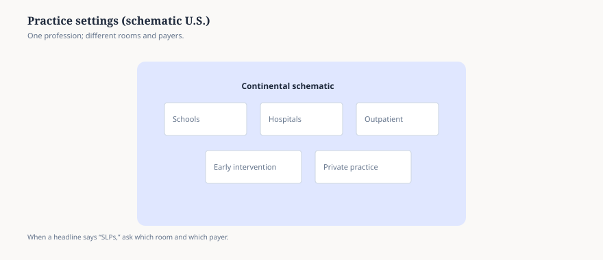

**Disclaimer.** Workforce explainer only — not salary data and not caseload statistics.

“SLPs” in a headline might mean school contract therapists, hospital swallowing specialists, or early-intervention evaluators. Payer rules, documentation templates, and union contracts differ.

The schematic map is a reminder to ask **which room** before you ask **what should I do Monday morning**.

<figure class="slpwow-figure slpwow-figure--infographic" itemscope itemtype="https://schema.org/ImageObject">
  
  <figcaption itemprop="caption">
    <strong>Figure 1.</strong> Where SLPs practice (schematic). Caseload law, billing, and documentation rules differ by setting — a news item about schools may not apply in a hospital swallowing clinic.
    SLPWOW SLP News — original editorial SVG. Not workforce statistics.
  </figcaption>
</figure>
