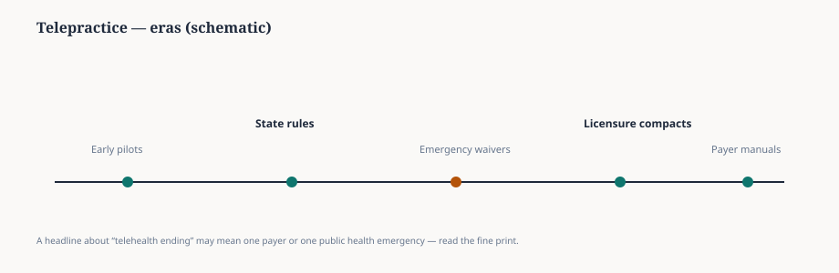

**Disclaimer.** Telehealth policy changes by state, payer, and setting.

Emergency telehealth waivers during public-health crises are not the same documents as everyday Medicaid manuals or school IEP service delivery rules. Compacts change where a license is recognized; they do not automatically change payer behavior.

Read the timeline, then check your state board and the payer manual that actually funds your session.

<figure class="slpwow-figure slpwow-figure--timeline" itemscope itemtype="https://schema.org/ImageObject">
  
  <figcaption itemprop="caption">
    <strong>Figure 1.</strong> Telepractice eras (schematic). Emergency telehealth rules and everyday Medicaid or school policy are not the same document — check the payer and the state.
    SLPWOW SLP News — original editorial SVG.
  </figcaption>
</figure>
