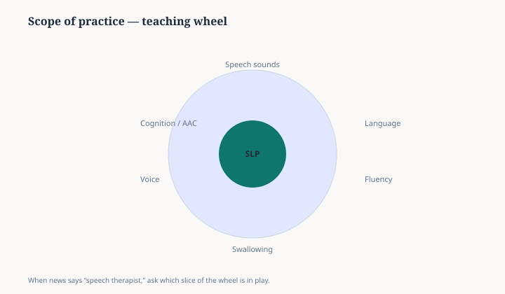

**Disclaimer.** Teaching schematic only — see ASHA’s official scope documents for authoritative language.

News items often mention one slice of the profession — fluency, swallowing, AAC — as if it were the whole job. The wheel is a reading aid when you evaluate whether a headline’s verb matches the clinicians in the story.

If the figure disagrees with ASHA’s published scope, trust ASHA.

<figure class="slpwow-figure slpwow-figure--infographic" itemscope itemtype="https://schema.org/ImageObject">
  
  <figcaption itemprop="caption">
    <strong>Figure 1.</strong> Scope wheel (schematic). ASHA’s scope documents are authoritative; this wheel is a reading aid when a news item mentions only one domain.
    SLPWOW SLP News — not an official ASHA diagram.
  </figcaption>
</figure>
