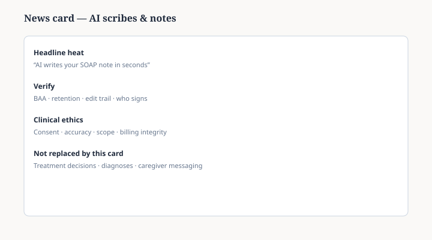

**Disclaimer.** Not vendor endorsement. Not HIPAA legal advice.

Documentation AI is in the news because vendors promise speed. Clinicians still **sign** notes and still owe accurate, billable, ethical records.

Before you pilot a scribe, verify business associate agreements, edit trails, retention, and who can export data. The card is a checklist habit, not a product review.

<figure class="slpwow-figure slpwow-figure--card" itemscope itemtype="https://schema.org/ImageObject">
  
  <figcaption itemprop="caption">
    <strong>Figure 1.</strong> AI documentation card (schematic). Vendor demos are not HIPAA BAAs; clinicians still attest to every note they sign.
    SLPWOW SLP News — original editorial SVG.
  </figcaption>
</figure>
