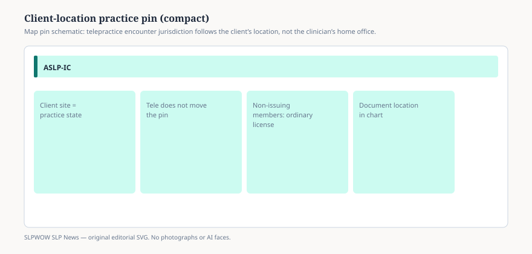

# Practice happens where the client is. The compact does not move the encounter.

WASHINGTON — Sept. 14, 2026 — The Audiology and Speech-Language Pathology Interstate Compact Commission located the work in one sentence on its home page: practice of audiology and speech-language pathology occurs in the state where the patient or client is located at the time of the patient or client encounter. The clinician’s zip code does not win. The screen does not win. The encounter does.

That sentence is why a compact privilege is sold per remote state, not as a national roaming pass. A privilege is equivalent to a license in a member that is issuing. It authorizes practice *there*, when the client is *there*. It does not pick the client up and set them down in the home state for the length of a Zoom tile.

## What the sentence does to telepractice

<figure class="slpwow-figure slpwow-figure--infographic" itemscope itemtype="https://schema.org/ImageObject">
  
  <figcaption itemprop="caption">
    <strong>Figure 1.</strong> The Commission’s geography sentence governs both in-person and tele encounters.
    SLPWOW SLP News — original editorial SVG. Not legal, billing, or clinical advice.
  </figcaption>
</figure>

If the client is in Baton Rouge and the SLP is in Wheeling, the encounter is Louisiana practice. If both boards are issuing and the clinician holds a qualifying home license plus a Louisiana privilege, CompactConnect is the mobility path. If the client is in a member that has enacted the compact but has not onboarded, the compact does not create a privilege for that hour. Ordinary licensure in the client’s state still applies.

ASHA’s 28 October 2025 public note remains the registration gate: practitioners cannot register with CompactConnect until the home state onboards. Louisiana and West Virginia were the first issuing pair that day. Ohio began processing on 9 February 2026. Tennessee was posted on 28 May 2026. Four issuing states. Thirty-three enacted members still in the queue. Fourteen jurisdictions with no active legislation on the 14 September 2026 map. None of those counts relocates a child.

The Commission lists “facilitates alternate delivery methods (Telehealth)” among the public benefits on the same home page that prints the location sentence. Facilitation is not relocation. The compact is designed to make a lawful privilege easier to obtain in a remote issuing member. It is not designed to pretend the encounter happened in the clinician’s home state because that is where the laptop sat.

## Mutual recognition still needs two live boards

The November 2025 newsletter quoted the compact’s purpose language on mutual recognition of other member-state licenses and treated 28 October 2025 as the day Louisiana and West Virginia made that purpose operational in CompactConnect. Mutual recognition is a legal mechanism among members that have finished onboarding. It is not a courtesy extended to a client who happens to live one county into a non-issuing member.

A home license in an issuing state plus a privilege in a second issuing state covers practice when the client is in that second state. A third member, enacted and dark on CompactConnect, is still a third license problem. Buying two privileges does not purchase the third.

School work inherits the same geography and then adds employer gates. The student is located at the school, or at the address where the district placed the session. The district still assigns the caseload. The state education agency may still want an educator certificate. An IEP that lists telepractice does not override the Commission’s location sentence or the remote state’s practice act.

## What the compact will not do for the hour of service

It will not move the encounter. It will not convert a non-issuing member into an issuing member because the clinician already paid $50 to the Commission for a different state. The February 2026 newsletter recorded that administrative fee per privilege; each remote state can still levy its own fee and jurisprudence. Paying those amounts for Ohio does not authorize a session whose client is sitting in an enacted-but-not-issuing neighbor.

It will not enroll the clinician in Medicare. Federal telehealth practitioner eligibility is a CMS clock. The compact is a state-agreement clock. They can both be true in the same week and still fail for different reasons.

It will not erase supervision rules, abuse-reporting statutes, or title-protection language in the client’s state. A privilege is license-equivalent in an issuing remote member. Equivalence is not a waiver of that member’s practice act.

## How to read a multi-state week

A traveling or telepractice SLP should list clients by location, not by the clinician’s hotel. For each location, ask two compact questions: is the home board onboarded, and is the remote board issuing? If either answer is no, CompactConnect is the wrong form. If both answers are yes, the privilege is the compact path for that location, and only that location.

The apply URL the Commission publishes is `https://app.compactconnect.org/Dashboard`. The map that tells you whether the remote color is “issuing” or merely “enacted” is `https://aslpcompact.com/compact-map/`. The home page will be updated, the Commission says, as more members launch. Until a member is listed as issuing, the location sentence still points at ordinary licensure.

## What SLPs should verify

Confirm where the client will sit for the session, including a student whose district calls the service “virtual.” Confirm that location’s board is issuing, not only enacted. Confirm the home state has onboarded. Treat each remote state as a separate privilege. Keep Medicare, Medicaid, and private-plan telehealth rules on a separate checklist. If the work is in a school, ask the district which educator credential it wants after the privilege question is answered.

This article does not offer clinical advice, billing guarantees, or diagnosis guidance.

## Sources

1. ASLP-IC home page — ASLP-IC Commission, update dated 28 May 2026. https://aslpcompact.com/
2. Compact Map — ASLP-IC Commission, accessed 14 Sept. 2026. https://aslpcompact.com/compact-map/
3. Interstate Compact Begins Issuing Compact Privileges — ASHA public news, 28 Oct. 2025. https://www.asha.org/news/2025/interstate-compact-begins-issuing-compact-privileges/
4. February 2026 Compact Newsletter — ASLP-IC Commission, 4 Feb. 2026. https://aslpcompact.com/wp-content/uploads/2026/02/February-2026-Compact-Newsletter-3.pdf
5. November 2025 Compact Newsletter — ASLP-IC Commission, 4 Nov. 2025. https://aslpcompact.com/wp-content/uploads/2025/11/November-2025-Compact-Newsletter-.pdf
