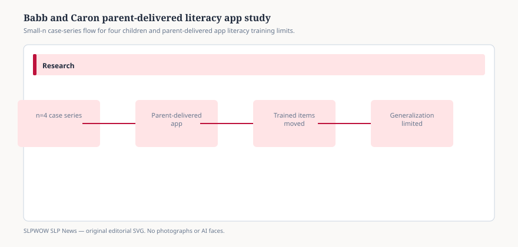

# Four children, one parent-delivered literacy app: what Babb and Caron can and cannot show

UNIVERSITY PARK — 2026 — Salena Babb and Jessica G. Caron tested whether parents, trained at a distance, could use the Accessible Literacy Learning app to teach three early literacy skills to children who use high-tech AAC. The report sits in the *American Journal of Speech-Language Pathology*, volume 35, issue 2, pages 431–447. The result is encouraging for a small single-case series. It is not a district adoption memo.

The design is a multiple-baseline-across-participants single-case study. Four children with minimal or no speech who used high-tech AAC received parent-implemented instruction on sound blending, decoding, and high-frequency words. Parents were trained virtually. Researchers monitored progress remotely and collected parent social-validity ratings. The authors note that the ALL *curriculum* already had an evidence base, that little work had tested the ALL *app*, and that no prior study had tested parent-implemented adapted literacy instruction of this kind. Those sentences are the study’s own limits, not a newsroom hedge.

## What moved, and what did not

<figure class="slpwow-figure slpwow-figure--infographic" itemscope itemtype="https://schema.org/ImageObject">
  
  <figcaption itemprop="caption">
    <strong>Figure 1.</strong> Small n studies illustrate mechanism; they do not set universal protocol.
    SLPWOW SLP News — original editorial SVG. Not legal, billing, or clinical advice.
  </figcaption>
</figure>

All four children improved on trained blending items, trained decoding items, and high-frequency words. Three of the four also improved on untrained blending and untrained decoding — the generalization the field usually wants and often does not get. All parents said the app was easy to use, appropriate for their child, and something they would keep using. The authors report that parents implemented the procedures with fidelity.

That is the entire experimental claim. There is no fifth child, no classroom comparison, no two-year follow-up in the published abstract and supplemental description, and no head-to-head test against another literacy program. Supplemental materials include probe summaries, word lists, a social-validity questionnaire, and a parent fidelity checklist. Those files document the study. They do not enlarge the sample.

The skills themselves are early and separable. Sound blending is the ability to assemble separately presented phonemes into a word. Decoding here is the application of letter-sound knowledge plus blending to a printed word, with a response that does not require speech. High-frequency words are taught as recognition items, not as proof that a child can read a book. The ALL curriculum, as Light and McNaughton framed it in earlier work the authors cite, was built around those adapted response modes. The 2026 paper’s contribution is the app-plus-parent delivery, not a new theory of reading.

Single-case multiple-baseline logic can show that change followed the start of instruction for each child, if baselines were stable and if the staggered start rules out a calendar coincidence. It cannot show that the typical preschooler who uses AAC will match these four. It cannot show that a school team without virtual coaching will match the parents in this study. It cannot show that high-frequency-word gains will become connected-text reading. It also cannot show maintenance after the researchers stop watching. Social validity — parents saying they would continue — is not the same as a follow-up probe six months later.

## Why the paper exists beside a larger literacy argument

A companion literature — including Light, Holyfield, McNaughton, Nieder, and Preece in *AAC* 41(3) — argues that people who need AAC are often shut out of literacy instruction that requires spoken answers, or handed picture systems that never become text. Babb and Caron sit on the other side of that complaint: an adapted, phonics-based app, used at home, with alternative response modes that do not require speech. The ALL approach, as Light and McNaughton described it in earlier curriculum work, is built for that constraint.

The temptation, for a school board or a vendor slide, is to collapse those two papers into “the app closes the literacy gap.” Babb and Caron do not say that. They say four children gained on trained skills, three generalized blending and decoding, and parents found the tool usable. They speculate that parent-delivered app instruction *could* increase instructional time and reduce abandonment. Speculation is labeled as such here because the *n* is four.

Remote coaching is part of the method, not a side note. Parents were trained virtually; probes were scored at a distance. That design answers a real access problem — many families do not live near an AAC-literacy specialist — and it also limits external validity. A district that hands a family a login without the training sequence, the fidelity checklist, or the probe schedule is not replicating Babb and Caron. A clinician who treats “parent-implemented” as “unsupervised” is not reading the method.

## What this study is not

It is not a mandate to buy or assign the ALL app. It is not evidence that parents should replace school literacy specialists. It is not a finding about children who use unaided AAC only, low-tech boards only, or no AAC. It is not a bilingual or biliteracy trial. It does not establish who among the many children with complex communication needs is a candidate. It does not report a cost, a dosage that districts must copy, or a fidelity percentage that another team must hit.

It is also not a diagnosis paper. “Minimal or no speech” and “high-tech AAC” are inclusion descriptors. They are not a protocol for identifying a communication disorder.

## What SLPs should verify

If a family or a district asks whether “the 2026 AJSLP study” supports a purchase, the accurate answer is that four children in a remotely coached, parent-implemented, multiple-baseline design made trained-item gains, and three generalized two of three skills. Ask for the child’s current instruction, the response mode the app requires, and who will be trained. Ask whether progress monitoring will look like the study’s probes or like a classroom running record. Read the article and the supplemental checklists at the DOI rather than a catalog blurb. If you need population-level literacy outcome data for students who use AAC, this paper does not supply it.

This article does not offer clinical advice, billing guarantees, or diagnosis guidance.

## Sources

1. Effects of Instruction With the Accessible Literacy Learning App on Three Literacy Skills for Children Who Use Augmentative and Alternative Communication — Babb and Caron, *American Journal of Speech-Language Pathology* 35(2), 431–447. https://doi.org/10.1044/2025_AJSLP-25-00218
2. ALL app literacy instruction supplemental material — ASHA Figshare. https://doi.org/10.23641/asha.30718034
