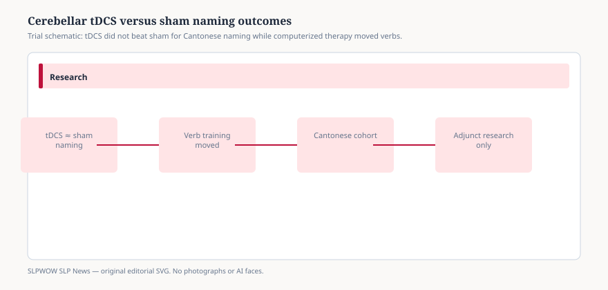

# Cerebellar tDCS did not beat sham for Cantonese naming. The computerized therapy still moved verbs.

HONG KONG — Jan. 28, 2026 — Transcranial direct current stimulation keeps showing up in aphasia posters as a portable adjunct. A University of Hong Kong team tested one popular alternative site — the right posterolateral cerebellum — in Cantonese speakers, a group almost absent from that literature. The paper, in *Brain Sciences* 2026, 16, 137 (DOI 10.3390/brainsci16020137), is a small, carefully blinded crossover. The adjunct did not win.

Maria Teresa Carthery-Goulart, Ada Chu, Anthony Pak-Hin Kong, and Mehdi Bakhtiar enrolled six adults with chronic left-hemisphere stroke and nonfluent aphasia (four men, two women; ages 53–78; 23–63 months post-onset). Ten people were screened; four missed the naming-accuracy window or the single-stroke rule. The design was randomized, double-blind, sham-controlled, and crossed: five consecutive days of a 60-minute computerized audio-visual naming program, with the first 20 minutes paired to either 2 milliamp anodal high-definition tDCS or sham, then a two-week washout and the other condition. Outcomes were timed noun and verb naming accuracy and reaction time on Object and Action Naming Battery items, modeled with mixed-effects methods at the trial level.

That is a lot of observations from a very small human sample. The authors say so. It is still *n* = 6 for anyone who wants to buy a stimulator. Screening used the brief Cantonese Aphasia Battery and a naming pretest that excluded people below 10 percent or above 80 percent accuracy. All six who remained were classified as nonfluent; five moderate, one severe. Four had MRI confirmation of a single left ischemic stroke; the other two had medical-record equivalents. Ethics approval is dated 21 December 2023 at the University of Hong Kong. Those details belong in a news account because they define who is *not* in the paper: acute patients, fluent aphasia, bilingual designs, and anyone whose naming was already near ceiling.

## What the group analysis actually said

<figure class="slpwow-figure slpwow-figure--infographic" itemscope itemtype="https://schema.org/ImageObject">
  
  <figcaption itemprop="caption">
    <strong>Figure 1.</strong> Null stimulation result still leaves therapy signal to interpret cautiously.
    SLPWOW SLP News — original editorial SVG. Not legal, billing, or clinical advice.
  </figcaption>
</figure>

The hypothesis was that anodal cerebellar stimulation would lift accuracy and speed relative to sham. The group model did not support that. A three-way interaction of condition, grammatical class, and time showed a different pattern: verb naming improved under sham, and those verb gains were larger than under active anodal stimulation. Reaction times got faster after the behavioral program, especially for verbs, without a tDCS-condition effect. Trained versus untrained items did not separate. Order of sham-first versus active-first did not matter. Pain ratings did not differ enough to unblind the conditions.

Single-case McNemar tests then pulled the average apart. One participant clearly gained under anodal stimulation, driven by nouns. Others gained only under sham, or in both conditions, or lost verbs under anodal current. The authors float polarity and homeostatic-learning hypotheses for verbs. They tested only anodal current, so they cannot settle polarity.

## Where this sits in a mixed literature

Cortical tDCS studies already disagree. Cerebellar studies are fewer and smaller. Some single-case and RCT reports have favored anodal or cathodal cerebellar current for spelling, naming, or caregiver-rated communication. Others have found little language change. Session counts in the positive reports often ran longer than five days. Several used overt speech or writing, not a button-press audio-visual match task adapted from Fridriksson and colleagues. This trial is the first the authors know of to compare nouns and verbs under cerebellar tDCS in the same naming set, and the first in Cantonese.

The honest placement is therefore: investigational adjunct, mixed evidence, this protocol did not outperform sham at the group level, and the behavioral task may still be worth studying on its own. That last clause is not a treatment endorsement. The study had no no-treatment control, so practice effects are not fully ruled out. Reaction-time analyses dropped 55.5 percent of trials because of errors and outliers, another limit the authors record. Immediate post-tests after five dense days may also reflect fatigue. They did not collect a delayed retention probe, caregiver-rated communication, or neuroimaging that would explain who responded.

Cantonese is not a footnote. Tonal morphology and a non-alphabetic script engage different neural correlates than the English and Italian samples that dominate cerebellar tDCS papers. The authors treat language-specific plasticity as an open question, not as proof that stimulation will fail in English. It is equally not proof that a U.S. clinic can import the montage.

## What this paper is not

It is not a shopping list of devices, montages, or clinics. It is not a finding that tDCS is ready for routine SLP practice. It is not a finding that anodal current is harmful; one polarity in six people is not a safety monograph, even though sessions were tolerated. It does not generalize to acute stroke, fluent aphasia, or alphabetic languages. It does not replace speech-language therapy.

## What SLPs should verify

If a course or a vendor cites “the 2026 Brain Sciences cerebellar study” as proof that stimulation boosts naming, the paper’s own group result is the opposite of that pitch. If someone cites it as proof that computerized audio-visual naming “works,” ask for the missing no-treatment arm and the six-person ceiling. Neuromodulation in the United States, when it happens at all, sits with physicians and research protocols, not with a typical school or outpatient SLP schedule. Read the DOI. Do not copy a milliamp number into a plan of care.

This article does not offer clinical advice, billing guarantees, or diagnosis guidance.

## Sources

1. Exploring the Effects of a Computerized Naming Intervention Combined with Cerebellar tDCS in Cantonese-Speaking Individuals with Aphasia — Carthery-Goulart, Chu, Kong, and Bakhtiar, *Brain Sciences* 16(2), 137, 28 Jan. 2026. https://doi.org/10.3390/brainsci16020137
