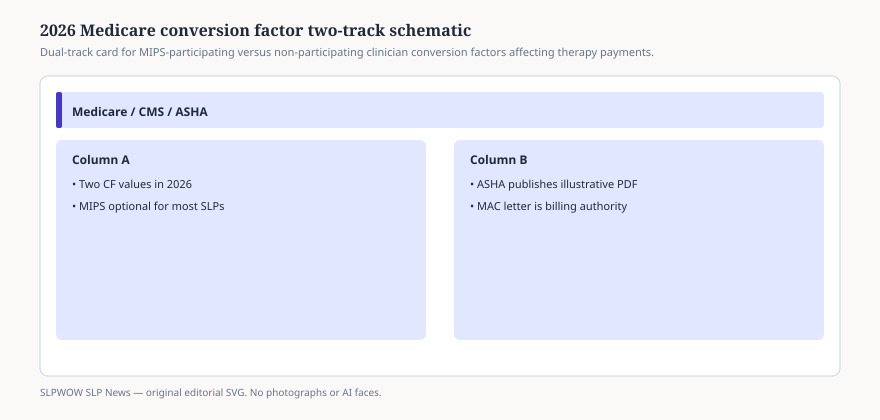

# Embed — 2026-medicare-conversion-factor-two-tracks-slps

```html
<figure class="slpwow-figure slpwow-figure--infographic" itemscope itemtype="https://schema.org/ImageObject">
  
  <figcaption itemprop="caption">
    <strong>Figure 1.</strong> Most SLPs are on the exempt track but still feel both numbers in policy fights.
    <span class="figure-credit">SLPWOW SLP News — original editorial SVG. Not legal, billing, or clinical advice.</span>
  </figcaption>
</figure>
```
