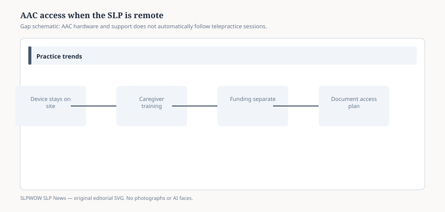

# Embed — aac-access-when-the-slp-is-remote

```html
<figure class="slpwow-figure slpwow-figure--infographic" itemscope itemtype="https://schema.org/ImageObject">
  
  <figcaption itemprop="caption">
    <strong>Figure 1.</strong> Telepractice opens the session; access still needs local logistics.
    <span class="figure-credit">SLPWOW SLP News — original editorial SVG. Not legal, billing, or clinical advice.</span>
  </figcaption>
</figure>
```
