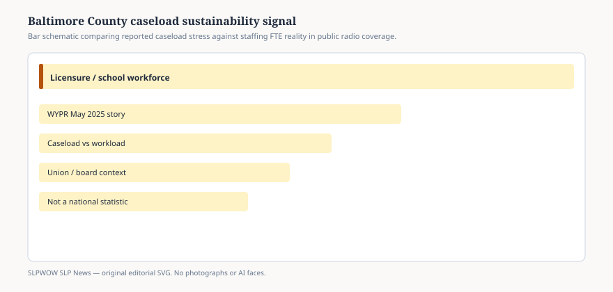

# Embed — baltimore-county-unsustainable-slp-caseloads

```html
<figure class="slpwow-figure slpwow-figure--infographic" itemscope itemtype="https://schema.org/ImageObject">
  
  <figcaption itemprop="caption">
    <strong>Figure 1.</strong> Reporter testimony is a signal; official ratios may lag.
    <span class="figure-credit">SLPWOW SLP News — original editorial SVG. Not legal, billing, or clinical advice.</span>
  </figcaption>
</figure>
```
