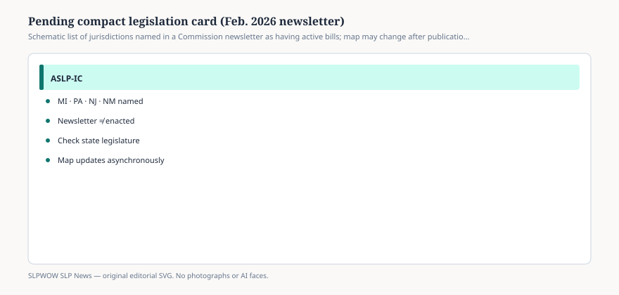

# Embed — pending-aslp-ic-bills-michigan-pennsylvania-new-jersey-new-mexico

```html
<figure class="slpwow-figure slpwow-figure--infographic" itemscope itemtype="https://schema.org/ImageObject">
  
  <figcaption itemprop="caption">
    <strong>Figure 1.</strong> Newsletter names are a snapshot; only enacted law and issuing status count for practice.
    <span class="figure-credit">SLPWOW SLP News — original editorial SVG. Not legal, billing, or clinical advice.</span>
  </figcaption>
</figure>
```
