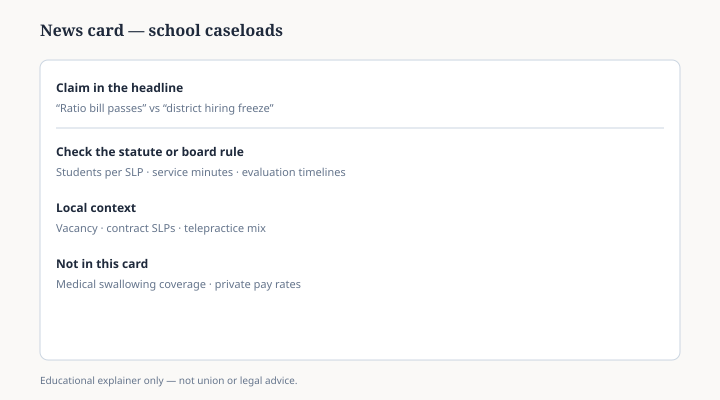

# Embed — school-caseloads-in-the-news

```html
<figure class="slpwow-figure slpwow-figure--card" itemscope itemtype="https://schema.org/ImageObject">
  
  <figcaption itemprop="caption">
    <strong>Figure 1.</strong> School caseload card (schematic). Ratio statutes, vacancies, and service minutes are different levers — verify which one a headline is actually about.
    <span class="figure-credit">SLPWOW SLP News — original editorial SVG.</span>
  </figcaption>
</figure>
```
