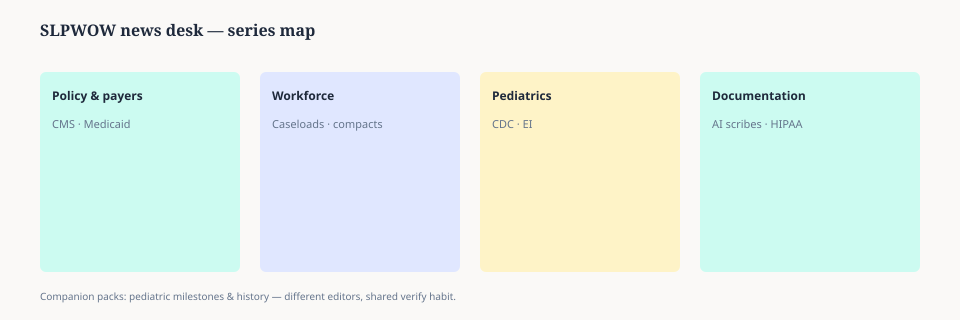

# Embed — slpwow-news-series-map

```html
<figure class="slpwow-figure slpwow-figure--infographic" itemscope itemtype="https://schema.org/ImageObject">
  
  <figcaption itemprop="caption">
    <strong>Figure 1.</strong> News desk map (schematic). SLPWOW News separates pediatric explainers, workforce policy, and documentation ethics — cross-links, not one pile of outrage clicks.
    <span class="figure-credit">SLPWOW SLP News — original editorial SVG.</span>
  </figcaption>
</figure>
```
