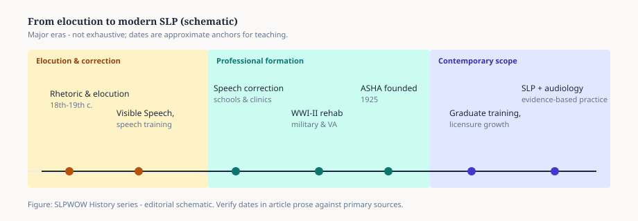
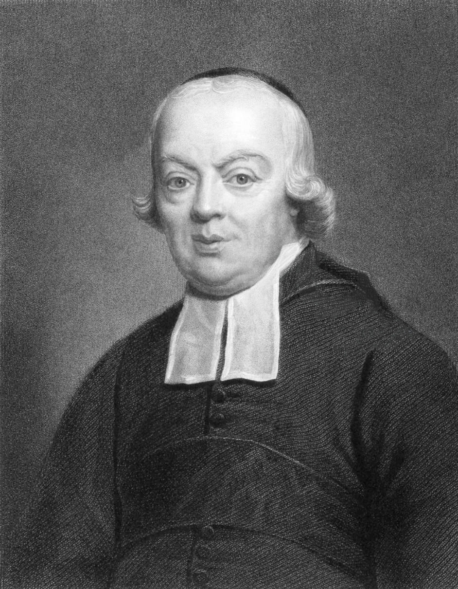

# Before the Clinic: Elocution, Oratory, and the Speaking Voice

In 1692, a Swiss physician working in Haarlem published a short Latin book with a boast in the title. Johann Conrad Amman called it *Surdus loquens* — the deaf man speaking. He claimed that a pupil who had never heard speech could be taught to talk by watching the mouth, feeling the throat, and copying the positions of the tongue. The book is small. The claim is not. For the next two centuries, anyone in Europe who wanted to argue that speech could be *taught* — not merely prayed over — had Amman’s pages to wave.

There was not yet a profession. There were pulpits, schoolrooms, and a few consulting rooms over shops. The people who worked on other people’s voices came from three trades that did not speak to one another.

<figure class="slpwow-figure slpwow-figure--timeline">
  
  <figcaption>
    <strong>Figure 1.</strong> From elocution to modern speech-language pathology (schematic). Dates in the bands are teaching anchors; the articles verify them against primary sources. SLPWOW History series — editorial graphic.
  </figcaption>
</figure>

## The orator’s shop

Elocution was a paying skill. In Edinburgh and London, men named Bell — Alexander Bell, then his son Alexander Melville Bell — sold the speaking voice to law students, clergymen, and anyone who stammered badly enough to pay. Melville Bell’s *Visible Speech* (1867) looks, to a modern clinician, like a phonetic alphabet drawn by an anatomist: hooks and bowls that stand for the lips, the tongue, the glottis. He meant it as a universal alphabet. He also meant it as a method. A stammerer, a foreigner, a deaf child — the same marks on the page were supposed to tell the mouth what to do.

James Rush in Philadelphia (*The Philosophy of the Human Voice*, 1827) and Andrew Comstock after him tried to do something similar in the United States: turn oratory into a physiology. Their readers were not clinic directors. They were boys who had to recite.

The habit matters. When American universities opened “speech” departments in the early 1900s, they already had debate coaches and expression teachers on the payroll. Speech correction grew in those corridors, not in medical schools. Sara Stinchfield’s 1909 diploma from the Curry School of Expression in Boston is not a quaint preface to her later Ph.D. It is the older trade still showing.

## The school for the deaf

A second trade was already arguing with itself. In Paris, Charles-Michel de l’Épée (1712–1789) built a school around signed language. In Leipzig, Samuel Heinicke (1727–1790) argued for spoken German and lipreading. The fight — later tagged “manualism” versus “oralism” — is not a side plot. It is the first large public argument about whether a communication difference is a language or a defect.

*Charles-Michel de l’Épée. Engraving after Claude-André Deseine. Public domain.*

Amman’s book sat on the oral side of that argument. So, later, did the Bells. A clinician writing in 2026 has to hold two facts at once: the oral teachers produced some of the first systematic descriptions of articulation, and their success, especially after the 1880 Milan congress, was used to push signed languages out of classrooms. History that only cheers the “first speech lesson” is advertising.

Heinicke’s surviving likenesses are poor. Amman’s are poorer — a postage-stamp reproduction, not a portrait you can hang. The work outlasted the pictures.

## The physician who would not yet stay

A third trade, medicine, noticed speech when it failed after a stroke or a bullet. That story belongs to Broca and Wernicke and is told next door. What belongs here is the gap. Nineteenth-century physicians named lesions. They did not open afternoon clinics for children who said *wabbit*. Teachers of the deaf did some of that work. Elocutionists did the rest. School inspectors in German cities, and later Hermann Gutzmann’s father Albert, a teacher of the deaf in Berlin, began to treat “speech errors” as a municipal problem — something a city might hire a person to fix.

By 1891 Gutzmann the son, a physician, had an outpatient room in Berlin for the speech-impaired. That is close to a clinic. It is still a medical specialty in the making, not the American university clinic of 1914.

## What the old trades left on the table

Three deposits survived into the profession that named itself in 1925.

**A phonetic conscience.** Visible Speech, Sweet’s phonetics, and the later IPA gave clinicians a way to write a lisp without mocking it. Scripture’s laboratory at Yale and Gutzmann’s Berlin measurements come out of that habit.

**A moral panic about the voice.** Elocution treated unclear speech as a social stain. Early “speech correction” inherited the stain and the urge to scrub it. You can hear it in the word *correction*. You can also hear the later revolt against that word in “communication sciences.”

**A jurisdictional mess.** Who owns a stammer — the elocutionist, the neurologist, the schoolteacher, the psychoanalyst? The twentieth century did not settle this. It built associations so the argument would have officers.

There is a story, older than Amman, that Demosthenes filled his mouth with pebbles and shouted at the sea. It is a good story. It is not evidence. The documentary trail for a *method* starts later: a Haarlem physician in 1692, a Paris school, a Leipzig school, an Edinburgh alphabet, a Berlin consulting room. The clinic — a university door with hours posted — is an American and Central European invention of the 1910s and 1920s. Everything before that is the raw material those doors were built from.

**Further in this series.** The lesion (essay 02). The Bells (essay 03 and the two Bell profiles). Gutzmann (essay 04). The first American university clinic (essay 08; Smiley Blanton).
