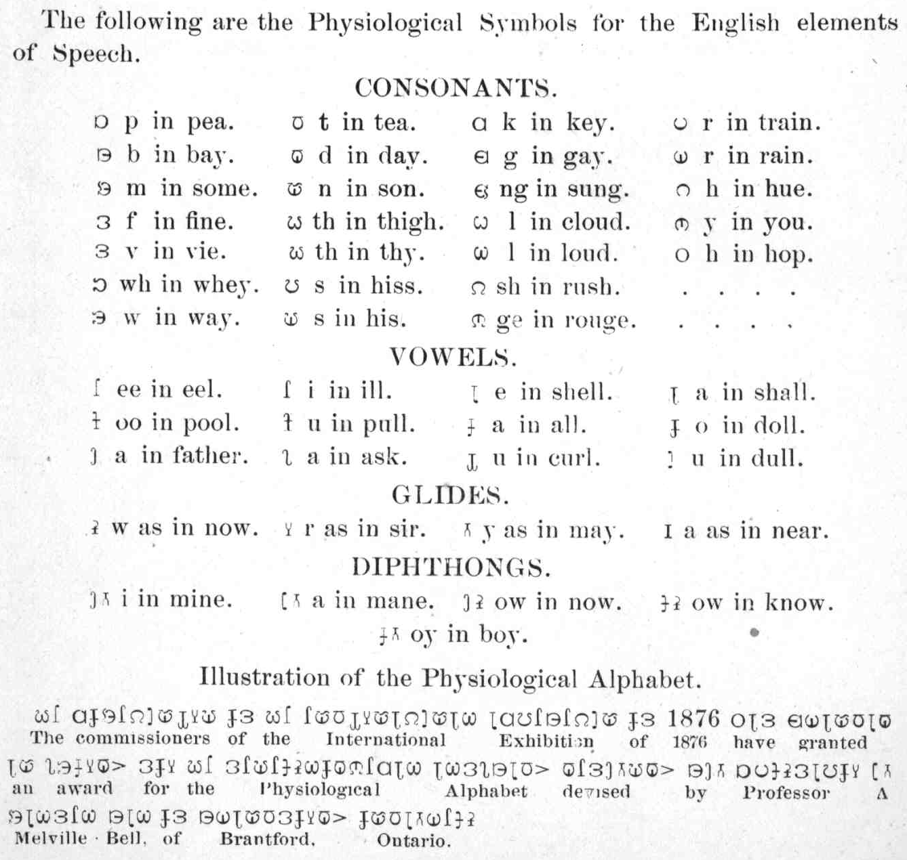

# Visible Speech and the Bell Family

The marks look like a plumber’s alphabet. A horseshoe for the glottis. A bowl for the lips. A stem that tells you where the tongue has gone. Alexander Melville Bell first showed the system in 1864 and published it in London in 1867 as *Visible Speech: The Science of Universal Alphabetics*. He believed a person could read any language off the page without having heard it, because the letters were pictures of the mouth at work.

He was an elocutionist, son of an elocutionist. The family business in Edinburgh and then London was the speaking voice: clergymen, barristers, stammerers. Visible Speech was meant to industrialize that business. It was also, from the start, a method for deaf pupils.

*English Visible Speech chart. Public domain. Wikimedia Commons.*

## The son as demonstrator

Alexander Graham Bell learned the system as a teenage assistant. In 1868 Melville went on a North American lecture tour and sent Aleck to Susanna Hull’s private school for deaf children in Kensington. The younger Bell was twenty-one. He already knew how to hold a room. Hull wanted to know whether congenital mute children — the phrase of the time — could be taught to articulate from the marks.

In 1871 he was in Boston, working with Sarah Fuller at the city’s new day school for deaf children. A talk he gave that year, preserved among the Bell Family Papers at the Library of Congress, is not a telephone lecture. It is a teacher’s lecture. He distinguishes the “semi-mute,” who once had speech and must not lose it, from the child who has never used the instrument. He wants a second notation, of his own, for pitch and force, because Visible Speech, he admits, does not show rhythm.

The telephone (1876) made him famous for a device. He told interviewers, then and later, that teaching the deaf was the work he would stand on. The Dictionary of Canadian Biography takes him at his word on the self-description and then records what the work became in public: the leading American name in oralism.

## Washington, the Volta, the association

The French government awarded Bell the Volta Prize in 1880, with 50,000 francs. He put the money into a laboratory and, in 1887, into the Volta Bureau in Washington. In 1893 he built the Bureau a building of its own and backed a journal that became *The Volta Review*. In 1890 he had already become the first president of the American Association to Promote the Teaching of Speech to the Deaf.

Those are institutional facts. They are also a program. The Bureau collected books on deafness and issued pamphlets on how to teach speech. Melville, late in life in Washington, kept writing Visible Speech primers for the Bureau imprint. The family had moved from a rented elocution studio to a national office with a mailing list.

## Milan and the long shadow

In 1880, the same year as the Volta Prize, the Second International Congress on Education of the Deaf met in Milan and passed resolutions preferring oral methods. Deaf teachers lost jobs. Signing in school was punished in places that took the resolutions as law. Bell did not write those resolutions alone, and the Canadian biography notes that he disagreed with some of the zealous reforms, including certain boarding-school schemes. His name still sat on the oralist door. He also wrote, in *Memoir upon the Formation of a Deaf Variety of the Human Race* (1883), about deaf intermarriage in a register that later readers correctly call eugenic.

A speech-pathology series that wants the Visible Speech chart without the 1883 memoir is asking for a souvenir. The chart is real. The harm is real. Later SLP training in articulation did not require Bell’s social program, and it does not excuse it.

## What clinicians actually kept

Three technical deposits lasted.

The idea that a speech sound can be *drawn as a posture* — a direct ancestor of every later articulatory diagram in a first-year textbook.

The idea that a deaf or hard-of-hearing child might be owed a spoken-language experiment, done carefully, with the child’s other languages (including signed languages) not treated as a failure. The second half of that sentence is the correction. Bell did not write it.

The institutional habit of a bureau: a library, a journal, a meeting. ASHA is not the Volta Bureau. Both are American answers to the same itch — to stop being a lone teacher with a private method.

Helen Keller and Annie Sullivan passed through Bell’s acquaintance; Mabel Hubbard, who became Mabel Bell, had been deaf from childhood scarlet fever and was among the Boston pupils in his orbit. Those lives are documented elsewhere. They do not make him gentle. They make him unavoidable.

**Further in this series.** Melville Bell (17). Alexander Graham Bell as a speech teacher, at length (18). Elocution’s longer run (essay 01).
