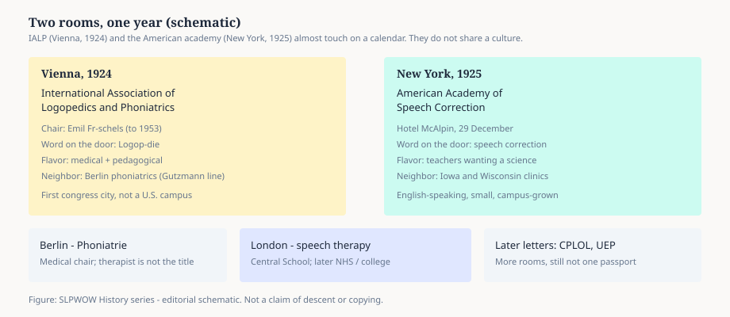

# Vienna, 1924: Logopedics Gets a Name

> **Portrait placeholder.** Emil Fröschels (1884–1972). No public-domain or clearly licensed portrait located as of the pack date. See `PORTRAIT_SOURCES.md` for hunt status. Do not invent or generate a substitute likeness.

In 1924 Emil Fröschels gave the work a word he could take across a border. *Logopädie* — logopedics — the study and treatment of speech defects, said as if it were already a science. He was forty, a laryngologist, director of a speech and hearing service in Vienna, and restless about names. “Speech correction” was an American classroom phrase. “Phoniatrics” was a Berlin medical chair. He wanted a term that could hold physicians, teachers, and the people who did the daily drills.

The same year he founded the International Association of Logopedics and Phoniatrics. He chaired it from 1924 until 1953, which is a long time to hold a gavel. IALP still meets. The word still appears on European diplomas, on South American university doors, on Japanese department letterheads. American students who have never heard it meet it the first time they read a foreign CV.

<figure class="slpwow-figure slpwow-figure--schematic">
  
  <figcaption>
    <strong>Figure 1.</strong> Two rooms, one year (schematic). IALP and the American academy almost touch on a calendar; they do not share a culture. SLPWOW History series — editorial graphic.
  </figcaption>
</figure>

## The city that trained the century

Fröschels took his M.D. at the University of Vienna in 1907. (A widely copied web page says “Jena in Vienna.” That is a slip. The Viennese records and the city wiki are clear.) He trained at the First University Ear Clinic under Viktor Urbantschitsch and then Heinrich Neumann. Urbantschitsch had already built an elaborate auditory-training practice for deaf children. The German speech doctors — Gutzmann, Liebmann, Treitel — were a train ride away. Sigmund Freud’s circle was a walk. Later Fröschels worked with Alfred Adler’s individual psychology and, in 1926, opened a speech clinic at the Poliklinik with Adler and Leopold Stein.

From 1910 to 1920 he ran a speech-medical outpatient service. In the First World War he headed a unit for head wounds and speech disorders at Garnisonsspital II. In 1924 he took the Neumann clinic and called it a logopedics clinic. He also helped Karl Cornelius Rothe start a Vienna school for speech-disturbed children. In 1927 the university made him associate professor.

This is a full professional life before the American academy has finished choosing a letterhead.

## 1938

Fröschels was Jewish. After the Anschluss he lost the clinic and the chair. He left in 1938, spent 1939–1940 as a research professor at the Central Institute for the Deaf, Washington University in St. Louis, then settled in New York: Mount Sinai, Beth David Hospital, Pace College, the Alfred Adler Institute. In 1941 he became president of the New York Society for Speech and Voice Therapy. He died in New York on 18 January 1972.

The Vienna school did not migrate as a faculty. It migrated as people. Leopold Stein went to Britain. Other names scattered. American speech pathology’s mid-century voice work — chewing method, some of the old Viennese drills that show up in later textbooks — often arrived in English without the street address.

## IALP and ASHA are not twins

IALP (1924) and the American Academy of Speech Correction (1925) are sometimes told as if one copied the other. The calendars almost touch; the cultures do not. IALP was international and medically flavored from the first meeting. The American group was small, English-speaking, and grown out of teachers of speech who wanted to look scientific. Fröschels could sit in both worlds. Most of the Iowa and Wisconsin people did not.

A global series that starts in Iowa City and never mentions the Vienna meeting is a national origin myth. The profession has several birth certificates. They do not cancel each other. They explain why a clinician in São Paulo, Vienna, and Kansas City can share a patient problem and not share a job title.

## The word on the door

*Logopedics* never won the United States. *Speech-language pathology* did, after several other tries. In much of Europe the logoped is the person who treats, and the phoniatrician is the physician. In Britain the door says speech and language therapist. The work overlaps. The unions, the ministries, the letters after the name do not.

Fröschels’s bet was that a single learned word might hold the overlap. It held a congress. It did not hold the century. What held was the idea that the work needed an international room — and that the room would have to be rebuilt, after 1938, in other cities, by people who had packed in a hurry.

**Further in this series.** Fröschels as a life (23). Gutzmann (21). The American founding, one year later (essay 06). Names that still do not match (essay 16).
