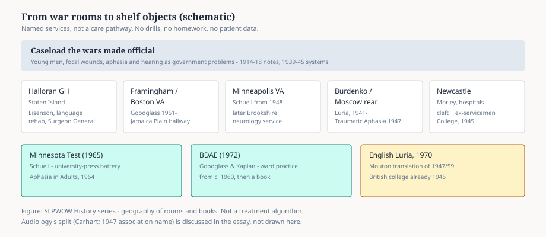

# The War Wards

The First World War taught a few hospitals what a young brain looks like after metal. Henry Head in Britain, Kurt Goldstein in Frankfurt, Fröschels in a Vienna garrison hospital, Gutzmann’s last Berlin years — the caseload was sudden, male, and documented. Then the peace scattered the notes.

The Second World War made the caseload a system. Governments that had learned to move blood and penicillin also moved speech.

<figure class="slpwow-figure slpwow-figure--schematic">
  
  <figcaption>
    <strong>Figure 1.</strong> From war rooms to shelf objects (schematic). Geography of services and books — not a care pathway. SLPWOW History series — editorial graphic.
  </figcaption>
</figure>

## The American surgeon general’s list

Jon Eisenson, already a Brooklyn College academic with a 1935 Columbia Ph.D., went into the war as a psychologist and came out a major. He established and supervised a language-rehabilitation program for the Surgeon General’s office and served as chief clinical psychologist for language rehabilitation at Halloran General Hospital on Staten Island. That sentence is from the obituaries. It is enough to locate the work: a named hospital, a military rank, aphasia as an official rehabilitation problem.

Other names passed through other posts. The Veterans Administration, expanded for the returning wounded, opened aphasia services that did not close in 1946. The National Veterans Aphasia Center at the Framingham VA hired Harold Goodglass in 1951 as its first psychologist. Hildred Schuell joined the Minneapolis VA in 1948, by her own later account knowing little about aphasia, and stayed until her death in 1970. Robert Brookshire later directed speech pathology in that same Minneapolis neurology service. The Boston VA in Jamaica Plain became, by the late 1950s, a place where Goodglass, Edith Kaplan, and Norman Geschwind could argue over lunch.

## What the wards forced into the open

Aphasia had been a chapter in a neurology book. On a VA ward it was a daily schedule. Men who were twenty-four and had been truck drivers needed more than a lesion name. They needed someone who would sit still while a sentence arrived in pieces. They needed a test that could be given again in six weeks. They needed a discharge note that a vocational counselor could read.

Schuell’s Minnesota Test and the 1964 book *Aphasia in Adults* are postwar objects. So is the Boston Diagnostic Aphasia Examination (Goodglass and Kaplan, 1972), which began as ward practice around 1960. Darley’s Mayo work on dysarthria is a civilian cousin: the same war-trained habit of listening hard, scoring what you hear, and refusing a single word — “dysarthria” — for six different mouths.

Audiology split into its own profession in the same hospitals. Raymond Carhart’s name is the one American textbooks still print. Hearing and speech shared wards, then budgets, then, in 1947, an association name: American Speech and Hearing Association.

## Not only America

Luria’s *Traumatic Aphasia* (Moscow, 1947) was built on Soviet military cases: young men, focal wounds, follow-up from the field hospital to the institute. He had opened a neuropsychology laboratory at the Burdenko Institute in 1936; the German invasion in June 1941 turned the laboratory into a war service. English readers did not get the book until 1970. The method — find the broken component, teach through the intact ones — was already in Russian print while American VA clinicians were still writing local mimeographs.

In Newcastle, Muriel Morley spent the war years seeing aphasic ex-servicemen in hospital sessions as well as children with cleft palate. Britain’s College of Speech Therapists (1945) is a postwar professional fact: a civilian college born while the wards were still full.

## What did not get a ward

The official story of war and speech is aphasia, hearing loss, facial wounds, the soldier’s voice. It is less often the child at home whose father did not return, or the refugee clinician who had to requalify. Fröschels was already in New York. Goldstein was in America. The war moved theories as well as patients.

It also moved money. NIH and VA research grants in the 1950s and 1960s paid for the longitudinal aphasia studies that a university clinic could not have floated in 1935. Schuell’s fifteen-year run (1948–1963) under Public Health Service grants is the type. The modern research university in this field is, in part, a demobilized hospital.

## Residue

A clinician who now writes “neurogenic communication disorders” on a syllabus is using a postwar category. The phrase assumes stroke, tumor, trauma, and degenerative disease as one teaching problem. Brookshire’s later textbook sold that category to undergraduates. The war wards sold it to the government first.

**Further in this series.** Eisenson (32). Schuell (34). Goodglass and Boston (essay 13; profile 37). Luria (38). Brookshire (40).
